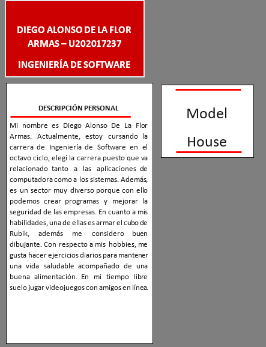

# **UNIT I**

---

# Introducción

## 1.1. Startup Profile

### 1.1.1. Descripción de la Startup

Nuestro equipo de desarrollo de aplicaciones multiplataforma se dedica a la misión de no solo cumplir, sino superar las expectativas de nuestros clientes, asegurando la plena satisfacción de sus necesidades. En nuestra búsqueda constante de la excelencia, llevamos a cabo investigaciones exhaustivas de mercado para concebir soluciones altamente efectivas, incluyendo la conexión entre empresas especializadas en remodelaciones de hogares inteligentes y los clientes que buscan estos servicios.

La aplicación ModelHouse es una parte esencial de nuestra plataforma. Utilizamos tecnologías inteligentes para conectar de manera eficiente a las empresas de remodelación de hogares inteligentes con los consumidores que desean transformar sus hogares en espacios más inteligentes y conectados. ModelHouse facilita la búsqueda y selección de empresas especializadas, lo que garantiza que los consumidores obtengan servicios de alta calidad que se adapten a sus necesidades específicas.

Nuestra plataforma no solo se enfoca en la comodidad, sino también en la eficiencia energética y la seguridad del hogar. Con ModelHouse, los usuarios pueden explorar una lista de empresas especializadas, revisar sus trabajos anteriores y recibir cotizaciones, brindándoles un control total sobre la elección de un socio de remodelación de hogares inteligentes.

Al combinar nuestra dedicación a superar las expectativas con la aplicación ModelHouse, estamos en constante evolución para simplificar el proceso de encontrar la empresa adecuada para la remodelación de hogares inteligentes, conectando a los consumidores con los expertos que pueden convertir sus sueños en realidad.

|                                                                                                                                                                            **Misión**                                                                                                                                                                             |                                                                                                                                                                                                           **Visión**                                                                                                                                                                                                            |
| :---------------------------------------------------------------------------------------------------------------------------------------------------------------------------------------------------------------------------------------------------------------------------------------------------------------------------------------------------------------: | :-----------------------------------------------------------------------------------------------------------------------------------------------------------------------------------------------------------------------------------------------------------------------------------------------------------------------------------------------------------------------------------------------------------------------------: |
| Nuestra misión es brindar un servicio de remodelación de alta calidad y confianza para nuestros clientes, destacando especialmente en la transformación de hogares en espacios inteligentes y conectados. Además, tenemos el compromiso de dar a conocer y apoyar el trabajo de pequeños emprendedores especializados en la remodelación de hogares inteligentes. | Nuestra visión es ingresar con éxito, permanecer de manera sólida y destacar en el mercado de servicios de remodelación, posicionándonos como una compañía intermediaria confiable entre clientes y empresas de remodelación que colaboran con nosotros. Aspiramos a ser reconocidos como una de las mejores aplicaciones en la categoría de remodelación, especialmente en el ámbito de remodelación inteligente (smart home). |

### 1.1.1. Perfiles de integrantes del equipo

  

  

  

  

  

  

  

## 1.2. Solution Profile

En ModelHouse, hemos desarrollado una solución completa para el proceso de remodelación de hogares, con un enfoque especial en la remodelación inteligente (smart home). Nuestra plataforma se distingue por su interfaz fácil de usar, la eficiencia en la gestión de proyectos y la integración de tecnología Smart Home.

ModelHouse se destaca por su interfaz intuitiva, diseñada para que tanto los clientes como las empresas de remodelación naveguen con comodidad. Esto facilita la búsqueda de opciones de remodelación y la obtención de información detallada sobre las empresas disponibles.

Nuestro sistema de Luces permite una gestión inteligente de la iluminación durante la remodelación, lo que se traduce en ahorro de tiempo y energía. Para las empresas de remodelación.

En resumen, ModelHouse es la solución integral que simplifica la remodelación y la hace más inteligente. Nuestra plataforma garantiza la satisfacción del cliente, apoya a emprendedores en el campo de la remodelación inteligente y ofrece opciones avanzadas para la creación de hogares conectados. Si deseas transformar tu hogar en un espacio inteligente y eficiente, ModelHouse es tu socio ideal.

### 1.2.1. Antecedentes y problemática

#### - **What?**

La remodelación de viviendas es una de las demandas más prominentes en la industria inmobiliaria, con un enfoque creciente en la transformación de hogares en espacios inteligentes. En Perú, el sector de la construcción ha experimentado un crecimiento constante, destacando las construcciones y ampliaciones. El 53% de los hogares ya vive en propiedades propias, y el 20% planea adquirir una nueva propiedad en 2019, con la necesidad de incorporar tecnología y servicios

#### - **Who?**

Identificamos a un sector de empresas que luchan por expandir su base de clientes debido a su enfoque tradicional, sin presencia en aplicaciones móviles.

#### - **Why?**

El servicio de remodelación de viviendas, especialmente la transformación en hogares inteligentes, está en demanda global debido a la creciente inversión en mejoras inmobiliarias tanto por particulares como por empresas de bienes raíces.

#### - **Where?**

Este problema no se limita a Perú, sino que afecta a nivel mundial, ya que muchas empresas aún no han adoptado aplicaciones móviles para sus servicios, lo que limita su alcance a los clientes ideales en el mercado de remodelación inteligente.

#### - **When?**

El problema que buscamos resolver es recurrente cuando las empresas buscan expandir su base de clientes, lo que sucede debido a la falta de conocimiento tecnológico o la falta de acceso a las plataformas adecuadas.

#### - **How?**

La entrega oportuna y la calidad son críticas en este problema, ya que los clientes exigen resultados precisos y plazos de entrega eficientes. Para abordar esto, buscamos ofrecer una solución que permita a las empresas llegar a más usuarios y ofrezca a los clientes opciones inteligentes al adquirir servicios de remodelación a través de una aplicación móvil en línea. Además, consideramos implementar soluciones IoT para el hogar que aporten eficiencia y comodidad en el proceso de remodelación y en la vida cotidiana de los clientes.

#### - **How Much?**

Desde la perspectiva de los empresarios, el costo se traduce en la pérdida de clientes debido a la falta de una presencia móvil inteligente. Para los clientes, el costo se refleja en el tiempo de espera para volver a habitar su vivienda. La implementación de soluciones inteligentes, como las tecnologías IoT para el hogar, ahorra tiempo y energía, mejorando la eficiencia en el proceso de remodelación y optimizando los costos.

### 1.2.2. Lean UX Process

#### 1.2.2.1 Lean UX Problem Statements

## Segmento Cliente

Nuestro enfoque inteligente e IoT para el segmento de clientes se basa en resolver la dificultad común de encontrar trabajadores de remodelación calificados y mejorar la eficacia en el proceso de búsqueda, especialmente en el contexto de la remodelación inteligente (smart home).

En un mundo donde los hogares inteligentes son la tendencia, es esencial que los clientes encuentren profesionales especializados en transformar sus hogares en espacios inteligentes y conectados. Nuestra aplicación les permite buscar fácilmente a través de un grupo selecto de profesionales que se especializan en la remodelación de hogares inteligentes. Esto les permite encontrar remodeladores calificados que pueden hacer realidad sus proyectos de hogar inteligente de manera eficiente.

Además, ofrecemos la capacidad de controlar y personalizar diversos aspectos de su hogar a través de tecnología IoT, como sistemas de seguridad avanzados, termostatos inteligentes, iluminación y sistemas de entretenimiento, permitiéndoles transformar sus hogares en espacios verdaderamente inteligentes y conectados.

En resumen, nuestra solución inteligente e IoT para el segmento de clientes se centra en conectarlos con profesionales especializados en remodelación inteligente y proporcionarles la capacidad de transformar sus hogares en espacios inteligentes y conectados, aprovechando la última tecnología IoT disponible.

## Segmento Empresa

Nuestra estrategia inteligente e IoT para el segmento de empresas de remodelación de inmuebles busca resolver el desafío de posicionamiento en el mercado y aprovechar las oportunidades que ofrece la tecnología smart e IoT en el sector de remodelación.

En un mundo donde los hogares inteligentes son cada vez más comunes, es esencial que las empresas de remodelación se destaquen como expertas en la transformación de hogares en espacios inteligentes y conectados. Nuestra aplicación les proporciona una plataforma inteligente donde pueden mostrar su experiencia en remodelación smart home, incluyendo tecnologías IoT para el hogar.

En resumen, nuestra solución inteligente e IoT para el segmento de empresas de remodelación se enfoca en posicionarlas como expertas en remodelación smart home y les proporciona herramientas tecnológicas para optimizar sus procesos y ofrecer proyectos de hogares inteligentes que aprovechen al máximo la tecnología IoT disponible.

#### 1.2.2.2 Lean UX Assumptions

### Business Assumptions

1.- Creemos que existe una demanda de clientes que necesitan una aplicación que simplifique la búsqueda de trabajadores para remodelaciones en propiedades.

2.- Suponemos que las necesidades de los clientes pueden ser satisfechas mediante el desarrollo de tecnologías como el lector de códigos QR, que facilitarán la interacción y el pago entre los usuarios.

3.- Consideramos que el valor más importante que los clientes desean de nuestro servicio es el ahorro de tiempo y la facilidad para encontrar trabajadores que resuelvan sus necesidades de remodelación de manera eficiente.

4.- Suponemos que facilitar la interacción entre clientes y trabajadores a través de un chat mejorará la comunicación y la colaboración entre ambas partes.

5.- Planeamos adquirir clientes iniciales mediante estrategias de marketing en redes sociales como YouTube, Facebook, Instagram, Twitter y otras plataformas.

6.- Nuestra principal fuente de ingresos será a través de comisiones por suscripciones de empresas de remodelación que utilicen nuestra plataforma.

7.- Identificamos a aplicaciones móviles y servicios similares que funcionan como intermediarios entre trabajadores y clientes, como nuestros principales competidores.

8.- Creemos que podemos superar a la competencia al ofrecer una supervisión detallada de cada proyecto para prevenir fraudes y garantizar la calidad de los servicios de remodelación.

9.- Reconocemos el riesgo de que algunos clientes prefieran buscar trabajadores de manera presencial o utilizar servicios de la competencia, pero confiamos en que nuestra propuesta de valor y supervisión efectiva nos ayudarán a mitigar este riesgo.

10.- Suponemos que nuestros clientes son personas con capacidad para utilizar dispositivos Android y/o iOS, lo que respalda la viabilidad de nuestra aplicación móvil como plataforma de búsqueda y contratación de trabajadores de remodelación.

### User Assumptions

### 1. ¿Quiénes son los Usuarios?

Nuestros usuarios son personas y empresas, de edades comprendidas entre los 20 y 45 años, que tienen la necesidad de remodelar propiedades, ya sea para uso personal o para mejorar su presencia en el mercado.

### 2. ¿Dónde encaja nuestro producto en su trabajo o vida?

Nuestro producto se integra en la vida y trabajo de los usuarios cuando desean remodelar un espacio habitable o laboral. Las empresas utilizan nuestra plataforma para encontrar clientes potenciales y asegurar su crecimiento a largo plazo.

### 3. ¿Qué problemas puede resolver nuestro producto?

Creemos que nuestro producto puede resolver el problema de los costos de entrada que pueden limitar el acceso de las pequeñas empresas de remodelación al mercado. Facilitamos la competencia y brindamos opciones asequibles para los usuarios.

### 4. ¿Cuándo y cómo se utiliza nuestro producto?

Nuestro producto se utiliza cuando surge la necesidad de remodelar una propiedad para mejorar la calidad de vida o mantener una presencia competitiva en el mercado. Los usuarios recurren a nuestra plataforma para conectarse con profesionales y empresas de remodelación. La plataforma debe transmitir confiabilidad y formalidad.

### 5. ¿Qué características son importantes?

Las características esenciales de nuestro producto incluyen una comunicación eficiente entre el cliente y la empresa de remodelación, así como el acceso a una variedad de empresas con diferentes enfoques de remodelación. Además, destacamos las características relacionadas con la eficiencia, como las soluciones IoT para el hogar, que incluyen el ahorro de tiempo y energía.

### 6. ¿Cómo debe verse y comportarse nuestro producto?

Nuestro producto debe transmitir confiabilidad y funcionalidad en su apariencia y comportamiento. Debe ofrecer una experiencia de usuario amigable y ágil para que los usuarios puedan utilizarlo sin dificultades. La plataforma debe ser vista como una herramienta confiable para la búsqueda y contratación de servicios de remodelación, respaldando la idea de negocio de manera sólida.

### Feature Assumptions

### 1. ¿Cómo puede ocasionar un impacto social?

Nuestra plataforma puede tener un impacto social positivo al generar oportunidades de empleo para trabajadores técnicos, como electricistas y albañiles, al conectarlos con clientes que necesitan servicios de remodelación con enfoque Smart Home. Además, características de automatización y control inteligente pueden mejorar la comodidad y eficiencia energética de los hogares.

### 2. ¿Qué problema social logrará solucionar?

Nuestra plataforma contribuirá a abordar el problema del desempleo entre trabajadores técnicos al conectarlos con clientes que buscan servicios de remodelación con enfoque Smart Home. También ayudará a los usuarios a mejorar sus hogares para hacerlos más cómodos y eficientes.

### 3. ¿En qué situaciones será útil?

Nuestra plataforma será útil en situaciones donde las personas necesiten llevar a cabo remodelaciones con tecnología Smart Home en sus hogares, departamentos o edificios. También será valiosa para empresas y técnicos especializados en busca de oportunidades de trabajo en el sector de remodelaciones inteligentes de viviendas.

### 4. ¿Cuáles son los sectores más influyentes?

Los sectores más influyentes para nuestra plataforma incluyen a las personas que son propietarias de viviendas, departamentos o edificios y que deseen realizar remodelaciones con tecnología Smart Home. Además, los técnicos especializados en remodelaciones inteligentes de hogares también se benefician al tener acceso a oportunidades de trabajo a través de nuestra plataforma.

### 5. ¿Qué beneficios considera que podría ayudar a las remodelaciones de hogares con tecnología Smart Home?

Nuestra plataforma puede mejorar la experiencia de remodelación de los clientes al facilitar la comunicación eficiente con las empresas de remodelación con enfoque Smart Home. Además, al ofrecer soluciones de automatización y control inteligente, los usuarios pueden transformar sus hogares en espacios más cómodos y eficientes desde el punto de vista energético.

### 6. ¿Qué características te diferencian de tu competencia?

Nos destacamos de la competencia al ofrecer una plataforma que se centra en remodelaciones con tecnología Smart Home. Nuestra plataforma permite una interacción más rápida y eficiente entre clientes y empresas de remodelación con enfoque Smart Home, lo que mejora la comunicación y la colaboración en el proyecto. Además, nuestras características de automatización y control inteligente distinguen nuestra plataforma al ofrecer un valor agregado significativo.

### 7. ¿Cómo debería de verse nuestro producto?

Nuestro producto debe tener una interfaz sencilla y fácil de usar, con indicaciones claras para los usuarios primerizos. La apariencia debe transmitir confiabilidad y funcionalidad diaria, destacando la simplicidad y la eficacia en la implementación de soluciones Smart Home. La plataforma debe enfocarse en aprovechar las características de automatización y control inteligente para respaldar la idea de negocio que hemos discutido a lo largo de esta conversación.

#### 1.2.2.3 Lean UX Hypothesis Statements

### Hipótesis 1

**Creemos que** al implementar un chat entre cliente y trabajadores, ofreciendo asesoramiento y aclaración de dudas sobre proyectos Smart Home y remodelación, aumentará la satisfacción del cliente y reducirá errores en el trabajo o en el presupuesto antes del contrato.
**Sabremos que** hemos tenido éxito **Cuando** veamos un incremento mensual del 10% de usuarios registrados interesados en proyectos de Smart Home y remodelación, así como una disminución en las quejas relacionadas con errores en proyectos.

### Hipótesis 2

**Creemos que** la demanda de servicios de refacción y remodelación de hogares con enfoque Smart Home es alta, y al ofrecer una plataforma que conecta a profesionales con habilidades técnicas y personas que necesitan estos servicios, lograremos un alto interés y demanda.
**Sabremos que** hemos tenido éxito **Cuando** veamos un aumento del 20% en solicitudes de proyectos relacionados con Smart Home y remodelación por parte de las empresas y una mayor participación de profesionales técnicos en la plataforma.

### Hipótesis 3

**Creemos que** al permitir que las empresas publiquen sus proyectos y reciban apoyo de nuestros usuarios, aumentaremos la confianza y la visibilidad de estas empresas, lo que resultará en un crecimiento de sus ventas.
**Sabremos que** hemos tenido éxito **Cuando** veamos un aumento del 15 % en las ventas de las empresas relacionadas con proyectos de Smart Home y remodelación publicados en nuestra plataforma.

### Hipótesis 4

**Creemos que** al mostrar el puntaje y el perfil de cada trabajador o empresa, aumentará la confianza de los usuarios y su disposición a contratar a estos profesionales para proyectos Smart Home y remodelación.
**Sabremos que** hemos tenido éxito **Cuando** veamos un incremento del 10% en proyectos de Smart Home y remodelación concluidos y una mayor participación de usuarios en la calificación de profesionales.

### Hipótesis 5

**Creemos que** al establecer términos y condiciones legales para el uso de la aplicación, fomentaremos la seriedad en la realización de contratos entre usuarios y empresas, lo que contribuirá a un ambiente de negocios confiable.
**Sabremos que** hemos tenido éxito **Cuando** veamos un aumento del 15% en el número de usuarios registrados interesados en proyectos Smart Home y remodelación, y una disminución en disputas legales.

### Hipótesis 6

**Creemos que** al proporcionar un espacio de reclamos y soporte eficiente, resolveremos las dudas de nuestros clientes y mejoraremos la percepción de profesionalismo tanto de trabajadores como de empresas en proyectos Smart
**Sabremos que** hemos tenido éxito **Cuando** veamos un incremento del 15% en usuarios registrados interesados en proyectos de Smart Home y remodelación y una disminución en quejas no resueltas.

### Hipótesis 7

**Creemos que** al ofrecer indicaciones claras y útiles cuando un usuario ingresa por primera vez a la aplicación, aumentaremos la retención de usuarios y su comprensión de cómo usar eficazmente la plataforma para proyectos Smart Home y remodelación.
**Sabremos que** hemos tenido éxito **Cuando** veamos un incremento del 10% en usuarios registrados y una disminución en la tasa de desinstalación de la aplicación después del primer uso.

#### 1.2.2.4 Lean UX Canvas

<table>
   <tr>
      <td align="center"><b>Business Problem</b></td>
      <td align="center"><b>Solution Ideas</b></td>
      <td colspan="3" align="center"><b>Business Outcomes</b></td>
   </tr>
   <tr>
      <td align="justify">La demanda de remodelación de hogares con enfoque Smart Home está en constante crecimiento, pero las personas a menudo tienen dificultades para encontrar servicios de calidad y tecnológicamente avanzados en este campo. ¿Cómo podemos mejorar el proceso de búsqueda y ejecución de servicios de remodelación Smart Home de manera eficiente?
      </td>
      <td rowspan="2">
         <ul>
            <li align="justify">Seguimiento en tiempo real del estado de los proyectos Smart Home, incluyendo el control de dispositivos y sistemas instalados.</li>
            <li>Integración de tecnologías Smart Home para la automatización de tareas y comodidad del usuario.</li>
         </ul>
      </td>
      <td colspan="3">
         <ul>
            <li align="justify">Aumento significativo en la cantidad de usuarios suscritos en la aplicación.</li>
            <li align="justify">Creación de un ecosistema confiable y preferido para usuarios que buscan servicios de remodelación Smart Home.</li>
            <li align="justify">Mayor utilidad y satisfacción de los usuarios con la aplicación.</li>
         </ul>
      </td>
   </tr>
   <tr>
      <td>
         <b>User & Customers</b>
         
Nuestros principales clientes son empresas y profesionales especializados en remodelaciones Smart Home que desean dar a conocer su trabajo. Además, personas interesadas en convertir sus hogares en espacios inteligentes.

      </td>
      <td colspan="3">
         <b>User Benefits</b>
         <ul>
            <li align="justify">Interfaz intuitiva y amigable para usuarios finales y empresas asociadas.</li>
            <li align="justify">Oferta de servicios de remodelación Smart Home adaptados a las preferencias y necesidades de los usuarios.</li>
            <li align="justify">Oportunidad de integrar tecnologías Smart Home después de la remodelación.</li>
         </ul>
      </td>
   </tr>
   <tr>
      <td>
         <b>Hypothesis</b>
         
Creemos que la demanda de remodelaciones Smart Home es alta y que al ofrecer una plataforma que conecta a profesionales especializados con personas que desean convertir sus hogares en espacios inteligentes, lograremos un alto interés y demanda.

         
Sabremos que hemos tenido éxito cuando veamos un incremento del 20% en solicitudes de proyectos Smart Home por parte de clientes interesados.

      </td>
      <td>
         <b>What’s the most important thing we need to learn first?</b>
         
Los usuarios aumentarán su interés hacia la aplicación si pueden visualizar y controlar dispositivos y sistemas Smart Home desde la plataforma. La retroalimentación de usuarios y profesionales sobre la integración de tecnologías Smart Home y la automatización de tareas será esencial para evaluar la efectividad de estas características.

      </td>
      <td colspan="3">
         <b>What’s the least amount of work we need to do to learn the next most important thing?</b>
         <ul>
            <li>Testing de la interfaz con dispositivos Smart Home.</li>
            <li>Colaboración con profesionales para la integración de tecnologías Smart Home.</li>
         </ul>
      </td>
   </tr>
</table>

## 1.3. Segmentos objetivo

Nuestro producto está dirigido hacia 2 segmentos objetivos.

#### Empresarios

**Empresas de remodelación de inmuebles enfocadas en Smart Home** que buscan una plataforma para promocionar sus servicios y ampliar su base de clientes en el sector de remodelaciones inteligentes.

#### Clientes

**Personas que buscan servicios de remodelación con tecnología Smart Home** para mejorar sus hogares y espacios de vida, y desean una plataforma eficiente, segura y fácil de usar para acceder a estos servicios.
