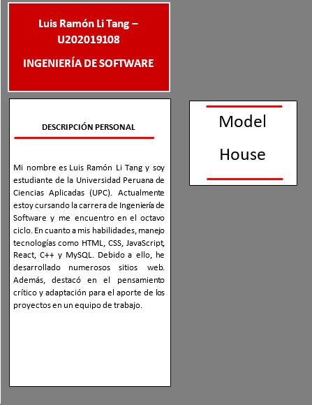
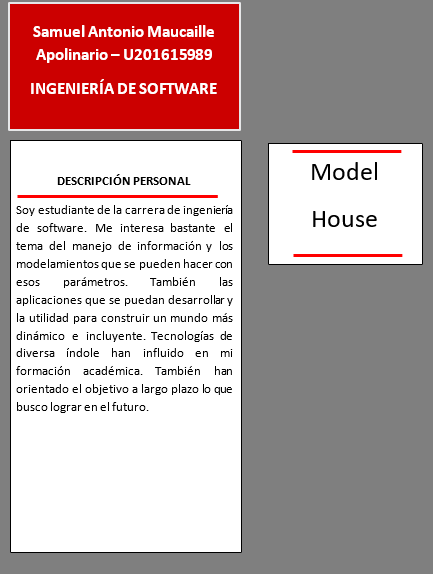

# **UNIT I**

---

# Introducción

## 1.1. Startup Profile

### 1.1.1. Descripción de la Startup

Nuestro equipo de desarrollo de aplicaciones multiplataforma se dedica a la misión de no solo cumplir, sino superar las expectativas de nuestros clientes, asegurando la plena satisfacción de sus necesidades. En nuestra búsqueda constante de la excelencia, llevamos a cabo investigaciones exhaustivas de mercado para concebir soluciones altamente efectivas, incluyendo la conexión entre empresas especializadas en remodelaciones de hogares inteligentes y los clientes que buscan estos servicios.

La aplicación ModelHouse es una parte esencial de nuestra plataforma. Utilizamos tecnologías inteligentes para conectar de manera eficiente a las empresas de remodelación de hogares inteligentes con los consumidores que desean transformar sus hogares en espacios más inteligentes y conectados. ModelHouse facilita la búsqueda y selección de empresas especializadas, lo que garantiza que los consumidores obtengan servicios de alta calidad que se adapten a sus necesidades específicas.

Nuestra plataforma no solo se enfoca en la comodidad, sino también en la eficiencia energética y la seguridad del hogar. Con ModelHouse, los usuarios pueden explorar una lista de empresas especializadas, revisar sus trabajos anteriores y recibir cotizaciones, brindándoles un control total sobre la elección de un socio de remodelación de hogares inteligentes.

Al combinar nuestra dedicación a superar las expectativas con la aplicación ModelHouse, estamos en constante evolución para simplificar el proceso de encontrar la empresa adecuada para la remodelación de hogares inteligentes, conectando a los consumidores con los expertos que pueden convertir sus sueños en realidad.

|                                                                                                                                                                            **Misión**                                                                                                                                                                             |                                                                                                                                                                                                           **Visión**                                                                                                                                                                                                            |
| :---------------------------------------------------------------------------------------------------------------------------------------------------------------------------------------------------------------------------------------------------------------------------------------------------------------------------------------------------------------: | :-----------------------------------------------------------------------------------------------------------------------------------------------------------------------------------------------------------------------------------------------------------------------------------------------------------------------------------------------------------------------------------------------------------------------------: |
| Nuestra misión es brindar un servicio de remodelación de alta calidad y confianza para nuestros clientes, destacando especialmente en la transformación de hogares en espacios inteligentes y conectados. Además, tenemos el compromiso de dar a conocer y apoyar el trabajo de pequeños emprendedores especializados en la remodelación de hogares inteligentes. | Nuestra visión es ingresar con éxito, permanecer de manera sólida y destacar en el mercado de servicios de remodelación, posicionándonos como una compañía intermediaria confiable entre clientes y empresas de remodelación que colaboran con nosotros. Aspiramos a ser reconocidos como una de las mejores aplicaciones en la categoría de remodelación, especialmente en el ámbito de remodelación inteligente (smart home). |

### 1.1.1. Perfiles de integrantes del equipo

  

  

  

  

  

  

  

## 1.2. Solution Profile

En ModelHouse, hemos desarrollado una solución completa para el proceso de remodelación de hogares, con un enfoque especial en la remodelación inteligente (smart home). Nuestra plataforma se distingue por su interfaz fácil de usar, la eficiencia en la gestión de proyectos y la integración de tecnología Smart Home.

ModelHouse se destaca por su interfaz intuitiva, diseñada para que tanto los clientes como las empresas de remodelación naveguen con comodidad. Esto facilita la búsqueda de opciones de remodelación y la obtención de información detallada sobre las empresas disponibles.

Nuestro sistema de Luces permite una gestión inteligente de la iluminación durante la remodelación, lo que se traduce en ahorro de tiempo y energía. Para las empresas de remodelación, ofrecemos un Autocompletado de Propuestas impulsado por Inteligencia Artificial, agilizando la creación de propuestas comerciales y mejorando la eficiencia en su trabajo.

En resumen, ModelHouse es la solución integral que simplifica la remodelación y la hace más inteligente. Nuestra plataforma garantiza la satisfacción del cliente, apoya a emprendedores en el campo de la remodelación inteligente y ofrece opciones avanzadas para la creación de hogares conectados. Si deseas transformar tu hogar en un espacio inteligente y eficiente, ModelHouse es tu socio ideal.

### 1.2.1. Antecedentes y problemática

#### - **What?**

La remodelación de viviendas es una de las demandas más prominentes en la industria inmobiliaria, con un enfoque creciente en la transformación de hogares en espacios inteligentes. En Perú, el sector de la construcción ha experimentado un crecimiento constante, destacando las construcciones y ampliaciones. El 53% de los hogares ya vive en propiedades propias, y el 20% planea adquirir una nueva propiedad en 2019, con la necesidad de incorporar tecnología y servicios inteligentes.

#### - **Who?**

Identificamos a un sector de empresas que luchan por expandir su base de clientes debido a su enfoque tradicional, sin presencia en aplicaciones móviles.

#### - **Why?**

El servicio de remodelación de viviendas, especialmente la transformación en hogares inteligentes, está en demanda global debido a la creciente inversión en mejoras inmobiliarias tanto por particulares como por empresas de bienes raíces.

#### - **Where?**

Este problema no se limita a Perú, sino que afecta a nivel mundial, ya que muchas empresas aún no han adoptado aplicaciones móviles para sus servicios, lo que limita su alcance a los clientes ideales en el mercado de remodelación inteligente.

#### - **When?**

El problema que buscamos resolver es recurrente cuando las empresas buscan expandir su base de clientes, lo que sucede debido a la falta de conocimiento tecnológico o la falta de acceso a las plataformas adecuadas.

#### - **How?**

La entrega oportuna y la calidad son críticas en este problema, ya que los clientes exigen resultados precisos y plazos de entrega eficientes. Para abordar esto, buscamos ofrecer una solución que permita a las empresas llegar a más usuarios y ofrezca a los clientes opciones inteligentes al adquirir servicios de remodelación a través de una aplicación móvil en línea. Además, consideramos implementar un "Sistema de Luces" para el ahorro de tiempo y energía, así como un "Autocompletado de Propuestas para Empresas con Inteligencia Artificial" para agilizar la generación de propuestas.

#### - **How Much?**

Desde la perspectiva de los empresarios, el costo se traduce en la pérdida de clientes debido a la falta de una presencia móvil inteligente. Para los clientes, el costo se refleja en el tiempo de espera para volver a habitar su vivienda. La implementación de soluciones inteligentes, como el "Sistema de Luces" y el "Autocompletado de Propuestas con Inteligencia Artificial", ahorra tiempo y energía, mejorando la eficiencia en el proceso de remodelación y optimizando los costos.

### 1.2.2. Lean UX Process

#### 1.2.2.1 Lean UX Problem Statements

## Segmento Cliente

Nuestro enfoque inteligente e IoT para el segmento de clientes se basa en resolver la dificultad común de encontrar trabajadores de remodelación calificados y mejorar la eficacia en el proceso de búsqueda, especialmente en el contexto de la remodelación inteligente (smart home).

En un mundo donde los hogares inteligentes son la tendencia, es esencial que los clientes encuentren profesionales especializados en transformar sus hogares en espacios inteligentes y conectados. Nuestra aplicación les permite buscar fácilmente a través de un grupo selecto de profesionales que se especializan en la remodelación de hogares inteligentes. Esto les permite encontrar remodeladores calificados que pueden hacer realidad sus proyectos de hogar inteligente de manera eficiente.

Además, ofrecemos la capacidad de controlar y personalizar diversos aspectos de su hogar a través de tecnología IoT, como sistemas de seguridad avanzados, termostatos inteligentes, iluminación y sistemas de entretenimiento, permitiéndoles transformar sus hogares en espacios verdaderamente inteligentes y conectados.

En resumen, nuestra solución inteligente e IoT para el segmento de clientes se centra en conectarlos con profesionales especializados en remodelación inteligente y proporcionarles la capacidad de transformar sus hogares en espacios inteligentes y conectados, aprovechando la última tecnología IoT disponible.

## Segmento Empresa

Nuestra estrategia inteligente e IoT para el segmento de empresas de remodelación de inmuebles busca resolver el desafío de posicionamiento en el mercado y aprovechar las oportunidades que ofrece la tecnología smart e IoT en el sector de remodelación.

En un mundo donde los hogares inteligentes son cada vez más comunes, es esencial que las empresas de remodelación se destaquen como expertas en la transformación de hogares en espacios inteligentes y conectados. Nuestra aplicación les proporciona una plataforma inteligente donde pueden mostrar su experiencia en remodelación smart home, incluyendo tecnologías IoT para el hogar.

Además del "Autocompletado de Propuestas para Empresas con Inteligencia Artificial", ofrecemos herramientas para la integración de tecnología IoT en proyectos de remodelación. Esto les permite ofrecer a sus clientes opciones de hogares verdaderamente inteligentes, desde sistemas de seguridad avanzados hasta soluciones de automatización del hogar.

En resumen, nuestra solución inteligente e IoT para el segmento de empresas de remodelación se enfoca en posicionarlas como expertas en remodelación smart home y les proporciona herramientas tecnológicas para optimizar sus procesos y ofrecer proyectos de hogares inteligentes que aprovechen al máximo la tecnología IoT disponible.

#### 1.2.2.2 Lean UX Assumptions

### Business Assumptions

1. Creo que mis clientes necesitan una aplicación que les facilite buscar un trabajador que se encargue de las remodelaciones de un inmueble.
2. Estas necesidades se pueden resolver con el desarrollo de tecnologías como el lector de código QR para conseguir la cuenta bancaria del usuario.
3. El valor más importante que un cliente quiere de mi servicio es el ahorro de tiempo al querer encontrar un trabajador que resuelva su problema con facilidad.
4. El cliente puede interactuar con los trabajadores por medio un chat, esto ayudará a una mejor interacción entre ambos usuarios.
5. Vamos a adquirir clientes iniciales por medio de redes sociales tales como YouTube, Facebook, Instagram, Twitter, entre otros.
6. Generamos ingresos por medio de porcentajes por suscripciones de empresas.
7. Mis principales competencias serán aplicaciones móviles o aplicaciones móviles que funcionen como intermediario entre trabajadores, como ARAM, REM (INGENIERÍA Perú SAC), DACOINSAC, entre otros.
8. Lograremos vencer a nuestra competencia ya que nuestra aplicación móvil contará con la supervisión de cada uno de los proyectos que se realizan, para así evitar fraudes al momento de que se realicen los proyectos.
9. El mayor riesgo sería cuando las personas quisieran buscar a un trabajador de forma presencial, o que recurra a nuestras competencias.
10. Mis clientes son personas con capacidad de manejo de dispositivos Android y/o iOS.

### User Assumptions

#### 1. ¿Quién es el usuario?

Empresas y personas, de 20 a 45 años, que buscan remodelar un inmueble.

#### 2. ¿Dónde encaja nuestro producto en su trabajo o vida?

Los clientes sienten la necesidad de remodelar sus ambientes en la cual viven o laboran.
Las empresas tienden a buscar clientes para sostenerse a largo plazo.

#### 3. ¿Qué problemas tiene nuestro producto? ¿Qué podemos resolver?

La implementación de los costos puede que no permita ingresar a las empresas pequeñas de remodelación al producto.

#### 4. ¿Cuándo y cómo es nuestro producto? ¿Es usado?

El producto es usado cuando se haya una necesidad o deseo de remodelar un inmueble para el bienestar hogareño de un conjunto de personas, asimismo, establecer comunicaciones con las personas que puedan brindar el servicio de remodelación. Por otro lado, el producto debe verse confiable y formal para brindarle seguridad al cliente que esté usando nuestro producto.

#### 5. ¿Qué características son importantes?

Las características más importantes de nuestro producto son la comunicación sencilla y rápida entre cliente y empresa, y el acceso a diferentes empresas con distintos estilos de remodelación a escoger. Además, se destacan las características de Sistema de Luces (Ahorro de tiempo y energía) y Autocompletado de la propuesta para las Empresas con Inteligencia artificial (Ahorro de tiempo) según sea necesario.

#### 6. ¿Cómo debe verse y comportarse nuestro producto?

Nuestro producto debe verse confiable y funcional diariamente. Este debe comportarse de forma amigable con una funcionalidad ágil, para que los usuarios no tengan problemas para usarlo.

### Feature Assumptions

#### 1. ¿Cómo puede ocasionar un impacto social?

Se puede ocasionar un impacto positivo en el rubro de trabajadores de hogares, tales como técnicos electricistas, albañiles, remodeladores, entre otros. Además, las características de Sistema de Luces (Ahorro de tiempo y energía) y Autocompletado de la propuesta para las Empresas con Inteligencia artificial (Ahorro de tiempo) pueden agilizar los proyectos, beneficiando a más trabajadores.

#### 2. ¿Qué problema social logrará solucionar?

Logra solucionar el desempleo de trabajadores técnicos, puesto que este tipo de trabajadores no cuentan con un trabajo estable, y se basan en posibles clientes.

#### 3. ¿En qué situaciones será útil?

Será útil cuando existan personas que necesitan una remodelación de su casa, departamento o edificio. También será útil para que empresas o técnicos especialistas puedan conseguir trabajo.

#### 4. ¿Cuáles son los sectores más influyentes?

Los sectores más influyentes son, personas que cuenten con una casa, departamento o edificio recién realizado para que así requieran personas especialistas en remodelaciones de hogares.

#### 5. ¿Qué beneficios considera que podría ayudar a las remodelaciones de hogares?

Podría ayudar a que los clientes tengan una buena experiencia del antes y después de las remodelaciones de su hogar, además de dar oportunidad de trabajo a varias personas, con el potencial de ahorro de tiempo y energía gracias al Sistema de Luces y al Autocompletado de propuestas con inteligencia artificial.

#### 6. ¿Qué características te diferencian de tu competencia?

Nos caracteriza que contamos con una interacción más rápida entre cliente y empresa, por lo cual habrá mejor comunicación en el transcurso del proyecto. Además, ofrecemos características como el Sistema de Luces y el Autocompletado de propuestas para empresas con inteligencia artificial que mejoran la eficiencia.

#### 7. ¿Cómo debería de verse nuestro producto?

Nuestro producto debe tener una interacción simple, fácil de usar y además tiene que contar con indicaciones para usuarios primerizos en la aplicación. La apariencia debe reflejar la confiabilidad y la funcionalidad diaria, con un énfasis en la simplicidad y la eficacia, aprovechando las características de ahorro de tiempo y energía proporcionadas por el Sistema de Luces y la inteligencia artificial.

#### 1.2.2.3 Lean UX Hypothesis Statements

#### Hypothesis Statement 1

**Creemos que** al implementar un chat entre cliente y trabajadores será una buena opción para que no haya errores en el trabajo o en el presupuesto antes del contrato.
**Sabremos que** hemos tenido éxito
**Cuando** veamos un incremento mensual del 10% de usuarios registrados.

#### Hypothesis Statement 2

**Creemos que** la refacciones y remodelaciones de hogares es un campo de gran demanda ya que hoy en día muchas personas requieren estos servicios, por lo que implementar una aplicación que proporcione trabajo a personas con habilidades técnicas y solventar necesidades de personas que necesiten estos servicios es muy buena.
**Sabremos que** hemos tenido éxito
**Cuando** veamos un incremento del 20% de solicitudes por parte de las empresas.

#### Hypothesis Statement 3

**Creemos que** cuando las empresas publiquen sus proyectos que estas recibirán y mayor apoyo por parte de nuestros usuarios ya que esto le brinda seguridad y es una buena forma de expandirse.
**Sabremos que** hemos tenido éxito
**Cuando** veamos un incremento del 15 % en las ventas de las empresas.

#### Hypothesis Statement 4

**Creemos que** cuando se muestre el puntaje el perfil de cada trabajador o empresa, esta podrá tener más clientes y así podrán recomendar a estos profesionales.
**Sabremos que** hemos tenido éxito
**Cuando** veamos un incremento del 10% en proyectos concluidos.

#### Hypothesis Statement 5

**Creemos que** teniendo temas legales en caso personas incumplan en el correcto uso de la aplicación, esto garantiza que los contratos se llevarán de manera seria entre usuario y empresa.
**Sabremos que** hemos tenido éxito
**Cuando** veamos un incremento del 15% en usuarios registrados.

#### Hypothesis Statement 6

**Creemos que** teniendo un espacio de reclamos podrá hacer eficiente resolver las dudas de nuestros clientes, así mismo podremos saber el profesionalismo de cada trabajador.
**Sabremos que** hemos tenido éxito
**Cuando** veamos un incremento del 15% en usuarios registrados.

#### Hypothesis Statement 7

**Creemos que** implementando pequeñas indicaciones cuando un usuario entra por primera vez a la aplicación.
**Sabremos que** hemos tenido éxito
**Cuando** veamos un incremento del 10% en usuarios registrados.

#### 1.2.2.4 Lean UX Canvas

<table>
    <tr>
        <td align="center">Business Problem</td>
        <td align="center">Solution Ideas</td>
        <td colspan=3 align="center">Business Outcomes</td>
   </tr>  
    <tr>
        <td align="justify">Las personas tienden a tener dificultades a la hora de buscar un servicio de remodelación, por ello, existe una baja tasa de búsqueda exhaustiva para encontrar ofertas de servicios de remodelación. ¿Cómo podríamos mejorar el proceso de búsqueda de este servicio en corto tiempo?
        </td>
        <td rowspan=2> 
                <ul>  
                <li align="justify"> Un seguimiento del estado del trabajo solicitado, así también como una sección inicial en la que el usuario podrá visualizar los prototipos de remodelación que le brindarán nuestros clientes para ser aprobados o no antes de realizarse.</li>                            <li>Tener un mejor manejo de los gastos y ganancias obtenidas, esto mejorando el plan de la suscripción hacia la máxima, pues al tenerla, se le mostrará un gráfico señalándolos por cada servicio realizado. 
                </li>
                </ul>
        </td>
        <td colspan=3><ul>
                <li align="justify">Aumento en la cantidad de usuarios suscritos en la aplicación 
                <li align="justify">Creación un espacio de confianza y preferencia hacia el usuario que requiera un servicio de remodelación
                <li align="justify">Aumento de utilidad de la aplicación
        </ul></td>
   </tr>
   <tr>
        <td>
            <b>User & Customers</b>
            
Nuestros principales clientes serán empresas u organizaciones independientes que quieran dar a conocer su trabajo y desempeño en el rubro de remodelación. Además, personas interesadas en realizar algún trabajo de remodelación en sus hogares.
        </td>
        <td colspan=3>
            <b>User Benefits</b>
               <ul>
                    <li align="justify">Contar con una interfaz amigable, confiable e intuitiva con el usuario.
                    <li align="justify">Mostrar servicios adecuados de acuerdo con las preferencias y solicitudes del usuario.
                    <li align="justify">Aumentar la visibilidad del servicio ofrecido por parte de nuestros clientes hacia los usuarios.
               </ul> 
        </td>     
   </tr>
   <tr>
       <td>
            <b>Hypothesis</b>
            
Creemos que la refacciones y remodelaciones de hogares es un campo de gran demanda ya que hoy en día muchas personas requieren estos servicios, por lo que implementar una aplicación que proporcione trabajo a personas con habilidades técnicas y solventar necesidades de personas que necesiten estos servicios es muy buena. 
Sabremos que hemos tenido éxito cuando veamos un incremento del 20% de solicitudes por parte de clientes interesados en el servicio de remodelación.
        </td>
        <td>
            <b>What’s the most important thing we need to learn first?</b>
            
Los usuarios aumentarán su interés hacia la aplicación si se les muestra distintas empresas, que previamente fueron evaluadas para mostrase en la plataforma, de acuerdo con el tipo de remodelación que necesiten.
            
El usuario, si es que tiene algún percance durante o después de realizado el servicio, podrá presentar un reclamo, el cual será evaluado, y de ser válido, podrá solicitar un porcentaje del dinero gastado, de acuerdo con la gravedad del problema.
        </td>
        <td colspan=3>
            <b>What’s the least amount of work we need to do to learn the next most important thing?</b>
               <ul>
                    <li>Testing
                    <li>Quick Survey
                    <li>User research
                    <li>Prototyping
               </ul> 
        </td>
   </tr>    
</table>

## 1.3. Segmentos objetivo

Nuestro producto está dirigido hacia 2 segmentos objetivos.

#### Empresarios

**Negocios del sector en remodelaciones de inmuebles** que no cuentan con una aplicación para su empresa, gustan publicar sus servicios y que desean ampliar su cartera de clientes, ya que su alcance actual es limitado.

#### Clientes

**Persona que necesite acceder a servicios de remodelación** según sus necesidades, buscando un sistema óptimo, amigable, seguro y cómodo para usar. Además, que tenga la necesidad de usar servicios Smart Home en su hogar.
