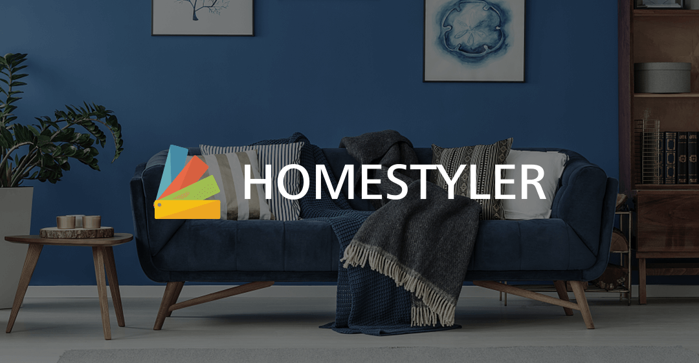

# REQUIREMENTS ELICITATION & ANALYSIS

## 2.1 Competidores

### 2.1.1 Análisis competitivo

<table>
    <tr>
        <td colspan=8 align="center">Competitive Analysis Landscape</td>
    <tr>
    <tr>
        <td rowspan=2 colspan=4 align="justify">¿Por qué llevar a cabo este análisis?</td>
        <td colspan=6 align="justify">Escriba en el recuadro la pregunta que busca responder o el objetivo de este análisis.</td>
    </tr>
    <tr>
        <td colspan=6 align="justify">El objetivo principal del Competitive Analysis Landscape es conocer sus competidores, en contraste con la idea principal que se tenga sobre ellos.</td>
    </tr>
    <tr>
        <td></td>
        <td></td>
        <td align="center" colspan=3>ModelHouse  </td>
        <td align="center">Homestyler  </td>
        <td align="center">Interior AI  </td>
        <td align="center">DomoTec Perú  </td>
    </tr>
    <tr>
        <td>Perfil</td>
        <td>Overview</td>
        <td colspan=3 align="justify">Una aplicación intermediaria entre el proveedor y el cliente. Que permite a este último, encontrar empresas de remodelación de calidad de manera rápida y la opción de comentar sus trabajos. En cuanto a los proveedores, tiene un canal donde mostrar sus proyectos y organizar sus actividades. Como opción adicional, además, podrá visualizar gráficos analíticos</td>
        <td align="justify">Homestyler es una plataforma en línea que permite a los usuarios diseñar y visualizar espacios interiores. Ofrece una amplia variedad de herramientas de diseño, incluyendo la capacidad de arrastrar y soltar muebles y decoración en planos 2D y 3D. Homestyler es conocido por su interfaz amigable y su comunidad en línea que comparte diseños y proporciona inspiración a otros usuarios.</td>
        <td align="justify">Interior AI es una empresa que utiliza inteligencia artificial para ayudar a los usuarios a tomar decisiones de diseño de interiores. Ofrece soluciones de diseño personalizadas basadas en datos y análisis de tendencias.</td>
        <td align="justify">DomoTec Perú es una empresa dedicada a la automatización del hogar y sistemas de control. Ofrecen soluciones para la gestión de iluminación, seguridad, clima y otros sistemas en el hogar.</td>
    </tr>
    <tr>
        <td>Perfil de Marketing</td>
        <td>Mercado objetivo</td>
        <td colspan=3 align="justify">Clientes entre los 27 y 45 años que tengan interés de una remodelación. Consumidores que buscan remodelar sus hogares de manera inteligente y conectada. Empresas especializadas en remodelación de hogares inteligentes que desean llegar a un público más amplio. Pequeños emprendedores especializados en la remodelación de hogares inteligentes que buscan oportunidades de negocio.</td>
        <td align="justify">Se dirige a una audiencia amplia, desde propietarios de viviendas que buscan redecorar sus hogares hasta profesionales del diseño de interiores que utilizan la plataforma para crear presentaciones visuales para clientes.</td>
        <td align="justify">Se enfoca en clientes que buscan soluciones de diseño altamente personalizadas y basadas en datos, como propietarios de viviendas que desean remodelar sus espacios de manera eficiente.</td>
        <td align="justify">Se dirige principalmente a propietarios de viviendas interesados en la automatización del hogar y la comodidad, así como a empresas que buscan soluciones de control para sus instalaciones.</td>
    </tr>
    <tr>
        <td>Perfil de Producto</td>
        <td>Productos & Servicios</td>
        <td colspan=3 align="justify">Encontrar al remodelador deseado mediante un buscador y filtro de búsqueda avanzada para encontrar a los trabajadores de acuerdo con sus intereses y podrá revisar el historial de proyectos para informarse de manera eficiente.</td>
        <td align="justify">Ofrece una plataforma en línea gratuita que permite a los usuarios diseñar espacios interiores, experimentar con diferentes diseños y productos, y obtener visualizaciones realistas. También ofrece una aplicación móvil para diseñar sobre la marcha.</td>
        <td align="justify">Ofrece un software de diseño de interiores impulsado por IA que toma en cuenta las preferencias y el estilo del usuario, así como las tendencias de diseño actuales. También proporciona recomendaciones de productos y distribución de muebles.</td>
        <td align="justify">Ofrece una gama de productos y servicios, que incluyen sistemas de control de iluminación, seguridad, climatización y entretenimiento en el hogar. También brindan servicios de instalación y mantenimiento.</td>
    </tr>
    <tr>
        <td>Análisis SWOT</td>
        <td>Fortalezas Oportunidades Debilidades Amenazas</td>
        <td colspan=3 align="justify">
        ➱Fortalezas:
        Dedicación a superar las expectativas del cliente.
        Plataforma ModelHouse para conectar eficientemente a consumidores y empresas.
        Enfoque en comodidad, eficiencia energética y seguridad del hogar.

➱Oportunidades:
Crecimiento en la demanda de hogares inteligentes.
Expansión a nuevos mercados geográficos.
Colaboración con empresas tecnológicas para integrar soluciones inteligentes.

➱Debilidades:
Posible competencia en el mercado de intermediación de servicios de remodelación.
Dependencia de la tecnología para la plataforma ModelHouse.

➱Amenazas:
Cambios en las tendencias del mercado de remodelación.
Competencia de plataformas similares.
Problemas de ciberseguridad relacionados con la plataforma tecnológica.
</td>
<td align="justify">
➱Fortalezas: Interfaz fácil de usar, amplia comunidad en línea para compartir diseños, opciones 2D y 3D, integración de productos de marcas reconocidas.
➱Oportunidades: Crecimiento continuo de la demanda de diseño de interiores en línea, posibilidad de colaborar con marcas de decoración y muebles para ingresos adicionales.
➱Debilidades: Limitaciones en la personalización avanzada, competencia en constante evolución en el mercado de diseño en línea.
➱Amenazas: Nuevos competidores emergentes, cambios en las preferencias del consumidor en diseño.</td>
<td align="justify">
➱Fortalezas: Uso de IA para personalización precisa, análisis de tendencias en tiempo real, diseño eficiente y basado en datos.
➱Oportunidades: Crecimiento en la demanda de soluciones de diseño impulsadas por IA, colaboraciones con empresas de tecnología y mobiliario.
➱Debilidades: Puede ser costoso de desarrollar y mantener, limitado por la disponibilidad de datos y la adopción de tecnología.
➱Amenazas: Competidores que ofrecen soluciones similares basadas en IA, preocupaciones sobre la privacidad de los datos.
</td>
<td align="justify">
➱Fortalezas: Experiencia en automatización del hogar, capacidad para personalizar soluciones, aumento de la demanda de hogares inteligentes.
➱Oportunidades: Crecimiento en la adopción de hogares inteligentes, colaboraciones con empresas de construcción y arquitectura.
➱Debilidades: Costos iniciales de implementación pueden ser altos, competencia en el mercado de automatización del hogar.
➱Amenazas: Cambios en las preferencias del consumidor, avances tecnológicos que podrían obsolescer productos existentes.
</td>
</tr>

</table>

### 2.1.2 Solution Software Design

Luego de analizar a nuestros competidores, hemos logrado observar que existen debilidades que aún no han sido resueltas. Esto puede ser utilizado en cuenta para mejorar y destacar, nuestro proyecto, de la competencia. Las ventajas competitivas que podemos desarrollar lo desarrollaremos como estrategias como:

- Capacitación sobre liderazgo de equipos.

- Campaña de marketing en universidades, institutos y empresas.

- Realizar actualizaciones de software cada que se requiera.

- Implementar una sección de mejora para recibir comentarios de la interfaz por parte del usuario.

- Establecer un chat de espera para contactarse con una empresa.

## 2.2 Entrevistas

### 2.2.1. Diseño de entrevistas

#### 2.2.1.1. Cliente

Datos demográficos:

- Nombre
- Edad
- Ubicación
- Ocupación
- Redes sociales utilizadas

Preguntas principales

1. ¿Cuál es el medio que utiliza para buscar un servicio de remodelación de
   inmuebles? ¿Por qué?
   

2. ¿Le resulta complicado comunicarse con una persona o empresa que brinda sus
   servicios de remodelación? ¿Por qué?
   

3. ¿Qué problema has encontrado cuando solicitaste un servicio de remodelación?

4. ¿Qué le brinda confianza para poder contratar una empresa que brinda este tipo
   de servicio?
   

5. Considera que una aplicación, web o móvil, para el servicio de remodelación es
   mejor que contactar con el proveedor de manera tradicional (vía teléfono)? ¿Por
   qué?
   

6. ¿Me puedes describir el tipo de servicio de remodelación Smart es “ideal” para
   ti?
   

7. ¿Cuáles son los factores más importantes que buscas en el servicio ofrecido?

#### 2.2.1.2. Empresa

Datos demográficos

- Nombre del entrevistado (representante de la empresa)
- Nombre de la empresa
- Tiempo de funcionamiento
- Ubicación
- Ocupación del entrevistado en la empresa

Preguntas principales

1. ¿Cuál es el medio que utilizan para comunicarse con un cliente?

2. ¿Qué tipo de clientes puedes encontrar en este tipo de servicio?

3. ¿Qué sucede cuando un proyecto no se entrega a tiempo?

4. ¿Cuál sería tu alcance ideal con los clientes?

5. ¿Piensas que una aplicación móvil sería beneficiosa para tu empresa? ¿Por qué?

6. ¿Cuáles son los problemas más frecuentes para contactar con los clientes?

7. ¿Cómo compites profesionalmente con otras empresas que brindan el mismo
   servicio?

8. ¿Qué valoras más de tus clientes?

9. ¿Cuáles fueron las circunstancias que te detuvieron para poder captar clientes
   nuevos?

10.¿Cuál es la confianza que le transmite su empresa al cliente?

### 2.2.2 Registro de entrevistas

**Usuario cliente**

**Entrevista 1**

<table>
    <tr>
        <th>Nombre</th>
        <th>Apellido</th>
        <th>Edad</th>
        <th>Distrito</th>
    </tr>
    <tr>
        <td>César Alejandro</td>
        <td>Zúñiga Villanueva</td>
        <td>25 años</td>
        <td>Surco</td>
    </tr>
    <tr>
        <td colspan="4" align="center"></td>
    </tr>
    <tr>
        <td colspan="4">URL: <a href="https://youtu.be/7VONLQr2u5U">https://youtu.be/7VONLQr2u5U</a></td>
    </tr>
    <tr> <td colspan="4" align="justify">Resumen de la entrevista: Trabaja como dueño de una empresa llamada Progreso HP
en Ayacucho desde el inicio de la pandemia. El medio que usa para contactarse con los
clientes es por medio de referencias de conocidos, amigos y familiares, por el cual se
contactan a través de vía telefónica y WhatsApp. Los clientes principales quieren
acabados interiores como paredes, pisos, entre otros. Para esto se llega a un acuerdo
previo, estableciendo un precio, la cual es negociable, dependiendo de la calidad de los
materiales y el tiempo de remodelación, y la cantidad de trabajadores que se van a
involucrar. Su grupo de técnicos especializados lo obtiene por conexiones familiares,
pero también requiere de búsquedas y capacitaciones por la limitación de expertos en
la localización de la compañía. Un problema que se puede apreciar es cuando los
clientes no te contestan para continuar con el avance del proyecto, generando consigo
retrasos innecesarios. Como es una empresa reciente, la penetración de mercado sería
ideal por medio de una aplicación móvil concurrida que los publicite y muestre sus
proyectos anteriores. Por otro lado, tiene un gran interés por visualizar gráficos
analíticos de manera adicional para ver como progresa su empresa para confirmar y
procesar datos de su crecimiento con mayor rapidez. También, piensa
responsabilizarse y no tener ningún inconveniente con sus clientes en un futuro.
Pagaría una suscripción que oscila entre 1000 a 2000 soles dependiendo de la
efectividad de su negocio.</td> </tr>
</table>

**Entrevista 2**

<table>
    <tr>
        <th>Nombre</th>
        <th>Apellido</th>
        <th>Edad</th>
        <th>Distrito</th>
    </tr>
    <tr>
        <td>Esmeralda</td>
        <td>Acuña Albitres</td>
        <td>22 años</td>
        <td>Surco</td>
    </tr>
    <tr>
        <td colspan="4" align="center"></td>
    </tr>
    <tr>
        <td colspan="4">URL: <a href="https://youtu.be/7VONLQr2u5U">https://youtu.be/7VONLQr2u5U</a></td>
    </tr>
    <tr> <td colspan="4" align="justify">Annsherly Acuña, quien es asistente en una empresa de remodelación, nos comenta que cuentan con espacios para realizar consultas e informes, tanto presencial como virtual (atención vía WhatsApp o correo). Estos para sus clientes, personas interesadas en remodelar sus casas u oficinas, que muestren interés en las remodelaciones. Además, piensa que una aplicación móvil ayudaría a llegar a más público, facilitándoles la búsqueda de información sobre su empresa. Ella recalca que su compañía ofrece atención oportuna y especializada, precios accesibles, una cotización con materiales de calidad requeridos para el usuario y asegurando, al mostrar, que sus trabajadores cuentan con las certificaciones correctas.</td> </tr>
</table>

### 2.2.3. Análisis de entrevistas

Luego de realizar las entrevistas diseñadas para el usuario cliente y empresa, hemos
obtenido información objetiva para el presente proyecto.

**Usuario cliente**

Análisis objetivo:

Se llega a reflejar la necesidad de una solución Smart para el proceso de remodelación
y construcción. Los clientes destacan la importancia de una comunicación clara y eficaz
durante todo el proceso, lo que podría resolverse mediante el uso de plataformas
digitales para mantener una comunicación fluida entre los trabajadores y el cliente.
También se existe una necesidad de confianza en los trabajadores y empresas
contratados, lo que podría ser abordado a través de la implementación de sistemas de
calificación y reseñas en línea que permitan a los clientes evaluar a los proveedores de
servicios de remodelación.
Además, se debe buscar inspiración y nuevas ideas para mantener el diseño
actualizado y atractivo, lo que podría ser satisfecho a través de una plataforma en línea
que permita a los clientes ver ejemplos de proyectos de remodelación anteriores y
proporcionar inspiración para nuevos proyectos.
En general, las soluciones Smart para la remodelación y construcción podrían abordar
estas necesidades al proporcionar una plataforma en línea que facilite la comunicación
clara y eficaz entre los trabajadores y los clientes, la implementación de sistemas de
calificación y reseñas en línea para aumentar la confianza en los proveedores de
servicios de remodelación y la integración de ejemplos de proyectos anteriores para
proporcionar inspiración y nuevas ideas para los clientes.

**Usuario empresa**

Análisis objetivo:

Se tiene en consideración la temática de espacios de remodelación Smart, contando con
perspectivas y enfoques diferentes. Se destaca la importancia de establecer una
comunicación efectiva con los clientes y ofrecerles opciones de calidad y
personalizadas para sus necesidades, lo que implica tener un equipo de técnicos especializados
en diferentes áreas. También se menciona la necesidad de penetrar en
el mercado a través de una aplicación móvil concurrida y de visualizar gráficos
analíticos para monitorear el crecimiento de la empresa.
Además, se enfatiza en la importancia de ofrecer atención oportuna y especializada a
los clientes, así como precios accesibles y cotizaciones detalladas con materiales de
calidad requeridos. Asimismo, se subraya la importancia de contar con trabajadores
certificados y tener espacios tanto presenciales como virtuales para ofrecer asesoría a
los clientes.

También, se pone de manifiesto la importancia de tener una comunicación efectiva
con los clientes y ofrecer soluciones personalizadas de calidad en el campo de la
remodelación. Además, se sugiere que la incorporación de tecnología inteligente y
soluciones innovadoras podría ser una ventaja competitiva para las empresas de
remodelación. En este sentido, una Smart Solution que integre tecnología y eficiencia
en los procesos de remodelación podría ser una solución atractiva para los clientes y
una oportunidad de diferenciación para las empresas. Una Smart Solution podría
ofrecer opciones como iluminación inteligente, sistemas de climatización eficientes,
automatización de procesos y monitoreo de recursos, entre otras. Estas soluciones
podrían ofrecer beneficios como reducción de costos energéticos, mayor comodidad y
eficiencia, y menor impacto ambiental, lo que podría ser una ventaja competitiva para
las empresas que buscan ofrecer soluciones innovadoras y atractivas para sus clientes.

## 2.3 Needfinding

A continuación, se mostrará los artefactos realizados de acuerdo a la retroalimentación de las necesidades de los usuarios a través de las entrevistas. Estos artefactos creados son para los dos tipos de segmentos objetivos: empresa de remodelación y cliente. Estos son user personas, user tax matrix, empathy mapping y el as-is escenario mapping.

### 2.3.1 User personas

#### 2.3.1.1 Cliente

<image
  src="../images/user-persona-cliente.png"
  alt="User persona cliente">

#### 2.3.1.2 Empresa de remodelación

<image
  src="../images/user-persona-empresa.png"
  alt="User persona empresa de remodelación">

### 2.3.2 User task matrix

Se realiza un análisis de las principales funciones detectadas en la problemática. Esto basado por los comentarios obtenidos de los 2 segmentos de usuario: Cliente y Empresa.

<table>
  <tr>
    <th rowspan="2">Task Matrix</th>
    <th colspan="2">Cliente</th>
    <th colspan="2">Empresa</th>
  </tr>
  <tr>
    <td >Frecuencia</td>
    <td >Importancia</td>
    <td >Frecuencia</td>
    <td >Importancia</td>
  </tr>
  <tr>
    <td>Brindar seguridad al realizar un acuerdo de remodelación</td>
    <td>A veces</td>
    <td>Alta</td>
    <td>Alta</td>
    <td>Alta</td>
  </tr>
  <tr>
    <td>Registro de los hechos que se realizan durante el periodo de remodelación</td>
    <td>Siempre</td>
    <td>Alta</td>
    <td>Siempre</td>
    <td>Alta</td>
  </tr>
  <tr>
    <td>Publicidad de proyectos de remodelación</td>
    <td>Nunca</td>
    <td>Baja</td>
    <td>Alta</td>
    <td>Media</td>
  </tr>
  <tr>
    <td>Registrar la cotización de la remodelación</td>
    <td>A veces</td>
    <td>Media</td>
    <td>Siempre</td>
    <td>Media</td>
  </tr>
  <tr>
    <td>Registrar reclamos en el transcurso de la cotización.</td>
    <td>Siempre</td>
    <td>Alta</td>
    <td>Siempre</td>
    <td>Alta</td>
  </tr>
</table>

### 2.3.3 Empathy mapping

#### 3.3.3.1 cliente

<image
  src="../images/empathy-mapping-cliente.png"
  alt="Emapthy mapping de cliente">

#### 3.3.3.2 empresa de remodelación

<image
  src="../images/empathy-mapping-empresa.png"
  alt="Empathy mapping de empresa">

### 2.3.4 As-is scenario mapping

#### 2.3.4.1 cliente

<image
  src="../images/as-is-scenario-mapping-cliente.png"
  alt="As-is scenario mapping cliente">

#### 2.3.4.2 empresa

<image
  src="../images/as-is-scenario-mapping-empresa.png"
  alt="As-is scenario mapping empresa">
