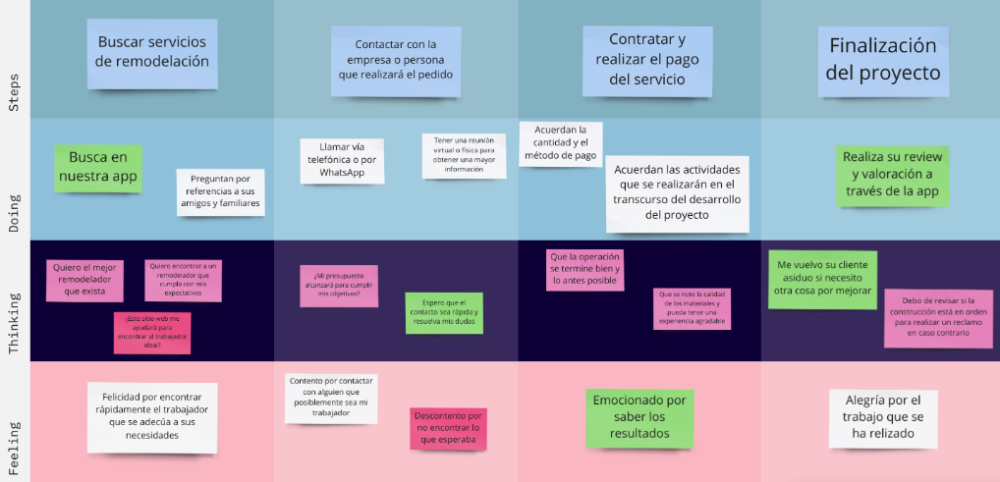
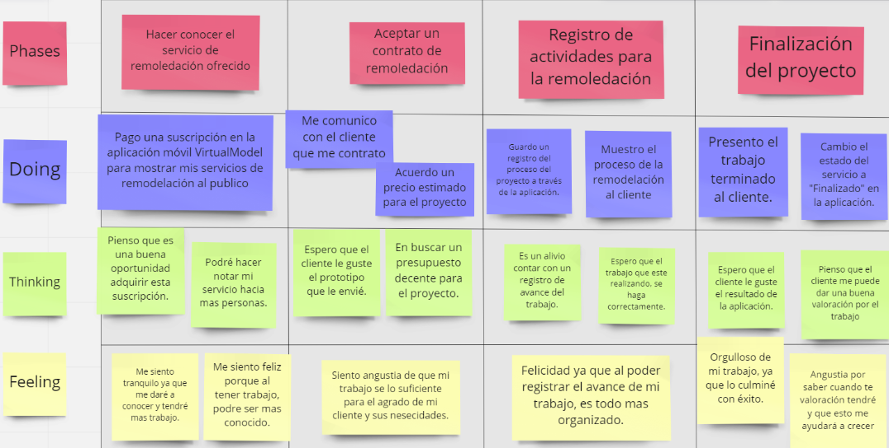
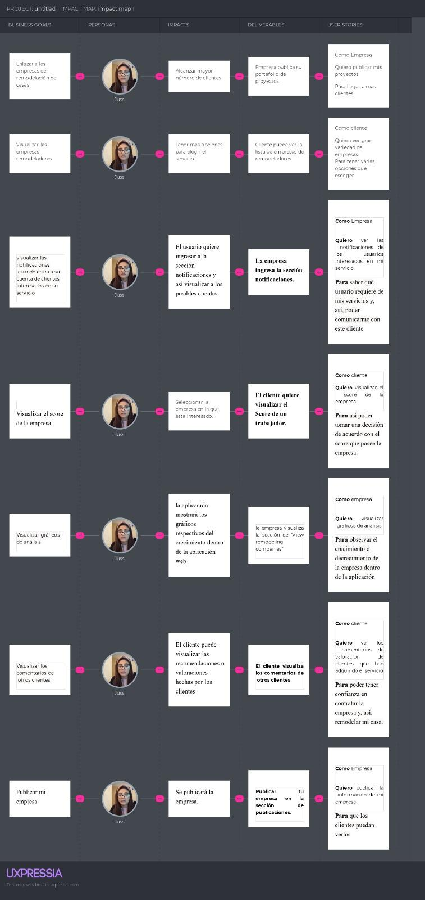

## **UNIT III**

---

### Requirements Specification

3.1. **To-Be Scenario Mapping**

3.1.1. **Usuario cliente**

3.1.2. **Usuario empresa**

3.2. **User Stories**

| User Story ID | Título                                                                 | Descripción                                                                                                                                                                                                   | Criterios de Aceptación                                                                                                                                                                                                                                                                                                                                                                                                                                                                                                                                                                                                                                                                                                                                                                                                                                                                                                                                                                                             |
|---------------|------------------------------------------------------------------------|---------------------------------------------------------------------------------------------------------------------------------------------------------------------------------------------------------------|---------------------------------------------------------------------------------------------------------------------------------------------------------------------------------------------------------------------------------------------------------------------------------------------------------------------------------------------------------------------------------------------------------------------------------------------------------------------------------------------------------------------------------------------------------------------------------------------------------------------------------------------------------------------------------------------------------------------------------------------------------------------------------------------------------------------------------------------------------------------------------------------------------------------------------------------------------------------------------------------------------------------|
| US01          | Visualizar las empresas de remodelación                                | Como visitante, quiero ver un catálogo de empresas de remodelación disponibles en mi área para que pueda evaluar sus servicios y escoger la mejor opción para mi proyecto                                     | ☑️ &#124;Escenario 1: Verificación de la lista de empresas de remodelación disponibles. Dado que el visitante ha ingresado a la plataforma cuando busco empresa en mi área, entonces deberá visualizar una lista de 10 empresas de remodelación registradas disponibles.   ☑️ &#124;  Escenario 2: Verificación de la funcionalidad de búsqueda avanzada. Dado que el visitante ha ingresado a la plataforma cuando busca empresas en mi área y aplica una búsqueda avanzada, entonces mostrará una lista de empresas de remodelación avanzada.                                                                                                                                                                                                                                                                                                                                                                                                                                                                 |
| US02          | Registro en la aplicación                                              | Como usuario, quiero crearme una cuenta para tener acceso a las funcionalidades y servicios del sitio web.                                                                                                    | ☑️ &#124;Escenario 1: Usuario se registra exitosamente. Dado que se le ha solicitado al usuario registrarse en la aplicación y el usuario completa sus datos cuando se ha registrado satisfactoriamente, entonces deberá ver la página principal.   ☑️ &#124;Escenario 2: Intento de registro de usuario fallido Dado que el usuario ha llenado sus datos de registro de la aplicación cuando hay un error en al menos uno de los campos, entonces recibirán un mensaje de error.                                                                                                                                                                                                                                                                                                                                                                                                                                                                                                                               |
| US03          | Acceso al perfil empresa                                               | Como representante de la empresa, quiero crear un perfil empresa para acceder a funciones adicionales que me permitan gestionar mi negocio de forma más efectiva                                              | ☑️ &#124;Escenario 1: Crear un perfil empresa. Dado que el representante de la empresa ya se ha registrado, cuando paga el plan de suscripción seleccionada, entonces podrá ver su perfil de empresa creada.   ☑️ &#124;Escenario 2: Intento fallido en la creación de perfil de empresa. Dado que el representante de la empresa ha iniciado sesión e intenta pagar el plan de suscripción seleccionada cuando el pago no ha sido rechazada entonces recibirá un mensaje de error de pago.                                                                                                                                                                                                                                                                                                                                                                                                                                                                                                                     |
| US04          | Publicación de proyectos realizados por el representante de la empresa | Como representante de la empresa, quiero publicar fotos y descripciones sobre proyectos realizados para que estén visibles en mi perfil empresa                                                               | ☑️ &#124;Escenario 1: La empresa sube sus proyectos pasados. Dado que el representante de la empresa ha iniciado sesión cuando publica sus fotos y descripciones sobre proyectos realizados, entonces se le mostrará un mensaje de éxito y se actualizará su perfil.   ☑️ &#124;Escenario 2: Los proyectos de la empresa son visitadas. Dado que he publicado un proyecto en el perfil de la empresa cuando otro usuario visite el perfil de la empresa entonces debería poder ver los proyectos que ha publicado la empresa, incluyendo el título, la descripción y su imagen del proyecto.                                                                                                                                                                                                                                                                                                                                                                                                                    |
| US05          | Envío de formulario de reclamo                                         | Como cliente, quiero subir un reclamo en línea si no estoy satisfecho con el servicio recibido para que sea resuelto de manera eficiente                                                                      | ☑️ &#124;Escenario 1: Formulario de reclamo enviado exitosamente. Dado que el cliente ha iniciado sesión y sube el formulario de reclamo cuando completa los campos requeridos y lo envía, entonces se mostrará en pantalla un mensaje de envío exitoso.   ☑️ &#124;Escenario 2: Error al enviar el formulario de reclamo. Dado que el cliente ha iniciado sesión y sube el formulario de reclamo, cuando completa no todos los campos requeridos y lo envía, entonces el envío será denegado y le mostrará un mensaje de error.                                                                                                                                                                                                                                                                                                                                                                                                                                                                                |
| US06          | Visualizar los comentarios de otros clientes                           | Como cliente, quiero leer las reseñas que otros usuarios han publicado para tener una referencia de la calidad de servicio que la empresa de remodelación brinda                                              | ☑️ &#124;Escenario 1: El cliente visualiza los comentarios de otros clientes. Dado que el cliente ha iniciado sesión y se encuentra en el detalle de la empresa seleccionada, cuando el cliente selecciona los comentarios y se han publicado previamente reseñas de otros clientes, entonces le mostrará la lista de comentarios sobre la empresa seleccionada.   ☑️ &#124;Escenario 2: El cliente no visualiza los comentarios de otros clientes. Dado que el cliente ha iniciado sesión y se encuentra en el detalle de la empresa seleccionada, cuando el cliente selecciona los comentarios y ningún otro cliente ha publicado alguna reseña, entonces le mostrará la lista de comentarios de la empresa seleccionada vacía con un mensaje.                                                                                                                                                                                                                                                                |
| US07          | Enviar una petición a una empresa                                      | Como cliente, quiero enviar una solicitud de servicio a una empresa para obtener servicios específicos que necesito                                                                                           | ☑️ &#124;Escenario 1: Generando una solicitud de servicio a la empresa seleccionada. Dado que el cliente ha iniciado sesión y selecciona el detalle de la empresa deseada, cuando completa el formulario de solicitud correctamente y lo envía, entonces se le muestra un mensaje de envío de solicitud exitoso.   ☑️ &#124;Escenario 2: Fallo en la generación de solicitud de servicio a la empresa seleccionada. Dado que el cliente ha iniciado sesión y selecciona el detalle de la empresa deseada, cuando no completa todo el formulario de solicitud correctamente y lo envía, entonces se deniega el envío y se le muestra un mensaje de error.  ☑️ &#124;Escenario 2: Opción de generar una solicitud de servicio a la empresa seleccionada bloqueada. Dado que el visitante no ha iniciado sesión y selecciona el detalle de la empresa deseada, cuando trata de ingresar a la solicitud de servicio, entonces se mostrará mensaje de primero iniciar sesión para continuar con la solicitud.    |
| US08          | Poder recibir, aceptar o denegar los pedidos de mis clientes           | Como representante de la empresa, quiero recibir, aceptar o denegar las solicitudes de servicio de mis posibles clientes para administrar mi negocio y poder iniciar el proyecto                              | ☑️ &#124;Escenario 1: Recibir solicitudes de servicio de remodelación. Dado que el representante ha iniciado sesión cuando recibe una solicitud de servicio de remodelación, entonces podrá visualizar el detalle de la solicitud.   ☑️ &#124;Escenario 2: Aceptar solicitudes de servicio de remodelación. Dado que el representante de remodelación ha iniciado sesión y recibe una solicitud de servicio de remodelación cuando acepte la solicitud, entonces se enviará una notificación a ambos perfiles de usuario y se modificará el estado del proceso de servicio y mostrará un mensaje de aceptación exitosa.   ☑️ &#124;Escenario 3: Denegar solicitudes de servicio de remodelación. Dado que el representante de la empresa ha iniciado sesión y recibe una solicitud de servicio de remodelación cuando deniegue la solicitud, entonces se enviará una notificación a ambos perfiles de usuario y se modificará el estado del proceso de servicio y mostrará un mensaje de petición denegada. |
| US09          | Cambiar el estado del proceso de servicio                              | Como representante de la empresa, quiero cambiar el estado del proceso del proyecto para informar al cliente el avance hasta su finalización del servicio                                                     | ☑️ &#124;Escenario 1: Cambio de estado de proyecto exitoso. Dado que el representante de la empresa gestiona sus proyectos cuando cambia el estado de proceso del proyecto, entonces se envía una notificación a ambos perfiles de usuario y muestra un mensaje de confirmación que realizó el cambio de estado.   ☑️ &#124;Escenario 2: Cambio de estado de proyecto fallido. Dado que el representante de la empresa gestiona sus proyectos cuando no tiene autorización de modificar el estado e intenta cambiar el estado de proceso del proyecto, entonces se envía una notificación a ambos perfiles de usuario y muestra un mensaje de error.                                                                                                                                                                                                                                                                                                                                                            |
| US10          | Recibir las notificaciones de servicio                                 | Como empresa o cliente, quiero recibir notificaciones para estar al tanto del proceso del proyecto y alarmarme por cualquier inconveniente                                                                    | ☑️ &#124;Escenario 1: Ingresa a la sección notificaciones. Dado que un usuario registrado inicia sesión y se encuentra en la página principal cuando selecciona las notificaciones recibidas, entonces se le mostrará una lista de las notificaciones y sus detalles.   ☑️ &#124;Escenario 2: Ingresa a la sección de notificaciones vacía. Dado que un usuario registrado inicia sesión y se encuentra en la página principal cuando aún no ha recibido notificaciones y lo selecciona, entonces se le mostrará una lista vacía y un mensaje.                                                                                                                                                                                                                                                                                                                                                                                                                                                                  |
| US11          | Tener mis empresas favoritas                                           | Como cliente, quiero poder seleccionar empresas y guardarlo como favoritos para poder acceder más rápido a ellas en un futuro                                                                                 | ☑️ &#124;Escenario 1: Guarda una empresa como favorito. Dado que el cliente inicia sesión cuando selecciona una empresa de remodelación como favorita, entonces lo almacenará en su lista de favoritos y mostrará un mensaje de agregado.   ☑️ &#124;Escenario 2: Remueve a una empresa como favorito. Dado que el cliente inicia sesión cuando selecciona una empresa de remodelación y remueve como favoritos, entonces se eliminará de la lista de favoritos y mostrará un mensaje de removido.                                                                                                                                                                                                                                                                                                                                                                                                                                                                                                              |
| US12          | Visualizar mis tarjetas de pagos                                       | Como usuario quiero visualizar mis tarjetas de pago donde previamente realicé un pago con esa tarjeta para facilitar el proceso de pago cuando el cliente ingresa todos sus datos de autenticación de tarjeta | ☑️ &#124;Escenario 1: Visualiza el método de pago anteriormente ingresado. Dado que el cliente busca el método de pago registrado cuando ingrese a su perfil y vaya al apartado Payments entonces podrá visualizar el último método de pago registrado.   ☑️ &#124;Escenario 2: No visualiza el método de pago anteriormente ingresado. Dado que el cliente busca el método de pago y no ha registrado ninguno aún cuando ingrese a su perfil y vaya al apartado Payments entonces no podrá visualizar el último método de pago registrado.                                                                                                                                                                                                                                                                                                                                                                                                                                                                     |
| US13          | Filtro en la búsqueda de empresas                                      | Como cliente, quiero filtrar las empresas usando ciertos criterios en mi búsqueda para encontrar rápidamente las empresas que cumplan con mis requisitos específicos                                          | ☑️ &#124;Escenario 1: Se usa el filtro de búsqueda para encontrar a una empresa Dado que el cliente requiere buscar a una empresa en específico cuando ingrese a la barra de búsqueda, entonces se les mostrará la opción de filtrar la búsqueda por categoría, antigüedad, etc.   ☑️ &#124;Escenario 2: Modifica el filtro de búsqueda para encontrar a una empresa. Dado que el cliente requiere buscar a una empresa en específico cuando ingrese a la barra de búsqueda y modifique el filtro, entonces se les mostrará la lista de empresas con el nuevo filtro.                                                                                                                                                                                                                                                                                                                                                                                                                                           |
| US14          | Poder editar mi perfil empresa                                         | Como representante de la empresa, quiero editar los datos de mi perfil para que me puedan contactar correctamente usando los datos actualizados                                                               | ☑️ &#124;Escenario 1: Editar la empresa publicada con datos válidos. Dado que el representante de la empresa inicia sesión y editar su perfil empresa cuando se reemplaza por datos con las restricciones correctas, entonces verá la modificación de la información de la empresa y se mostrará un mensaje de edición exitosa.   ☑️ &#124;Escenario 2: Editar la empresa publicada con datos inválidos. Dado que el representante de la empresa inicia sesión y edita su perfil de la empresa cuando se reemplaza por datos con las restricciones incorrectas, entonces se mostrará un mensaje de error.                                                                                                                                                                                                                                                                                                                                                                                                       |
| US15          | Visualizar los detalles del proceso de servicio                        | Como cliente, quiero visualizar los detalles completos del proceso de servicio para conocer todos los aspectos del servicio y tomar decisiones sobre su progreso                                              | ☑️ &#124;Escenario 1: Revisa la propuesta.   ☑️ &#124;Escenario 1: el cliente quiere revisar la propuesta. Dado que el cliente recibió una propuesta para el proyecto solicitado. Cuando este lo revise y apruebe. Entonces se continuará y ejecutará la orden.                                                                                                                                                                                                                                                                                                                                                                                                                                                                                                                                                                                                                                                                                                                                                 |
| US16          | Calificar una empresa                                                  | Como cliente, quiero calificar a una empresa de remodelación al finalizar el proyecto en función a mi experiencia personal para ayudar e informar a otros usuarios de la calidad de servicio recibida         | ☑️ &#124;Escenario 1: Calificar un servicio. Dado que el cliente se encuentre en la sección de “View remodeling companies”. Cuando haga click a una empresa. Y presiona una cantidad de estrellas. Entonces se añadirá una calificación a la empresa.                                                                                                                                                                                                                                                                                                                                                                                                                                                                                                                                                                                                                                                                                                                                                               |
| US17          | Seleccionar el plan de suscripción                                     | Como usuario, quiero seleccionar un plan de suscripción que mejor se adapte de acuerdo con mis necesidades y presupuesto para acceder a una mayor cantidad de funcionalidades dentro de la aplicación         | ☑️ &#124;Escenario 1: Ingresa correctamente su información de pago. Dado que el usuario selecciona un plan de suscripción y acepta los términos y condiciones cuando ingresa los datos necesarios correctamente para el método de pago seleccionado, entonces el sistema envía un correo de comprobación que confirma que el usuario cuenta con los servicios del plan seleccionado.   ☑️ &#124;Escenario 2: Ingresa incorrectamente su información de pago. Dado que el usuario selecciona un plan de suscripción y acepta los términos y condiciones cuando ingresa los datos necesarios incorrectamente para el método de pago seleccionado, entonces el sistema muestra un mensaje de error sobre el pago que no se ha realizado.                                                                                                                                                                                                                                                                           |
| US18          | Modificar el plan de suscripción                                       | Como usuario, quiero modificar mi plan de suscripción para que se adecúe mejor a mis necesidades y presupuesto para acceder a los servicios de la aplicación                                                  | ☑️ &#124;Escenario 1: Selecciona un nuevo plan de suscripción. Dado que el usuario presiona la opción de cambio de plan de suscripción cuando selecciona un nuevo plan, entonces el sistema envía un correo de comprobación y el plan del usuario es modificado.   ☑️ &#124;Escenario 2: Selecciona el mismo plan de suscripción que tiene en el presente. Dado que el usuario presiona la opción de cambio de plan de suscripción cuando selecciona el mismo plan con el que cuenta en el presente, entonces el sistema le notifica que ha seleccionado el plan que tiene y necesita seleccionar otro plan.                                                                                                                                                                                                                                                                                                                                                                                                    |
| US19          | Gestionar el plan de suscripción                                       | Como usuario quiero gestionar mi plan de suscripción para estar pendiente de este y las garantías que aún tengo disponibles                                                                                   | ☑️ &#124;Escenario 1: Ver plan de suscripción. Dado que el usuario se encuentra en la ventana de gestión de plan de suscripción cuando ingresa al detalle de su plan, entonces se le muestra en pantalla su plan de suscripción actual, la información de su plan y un historial de pagos detallado.   ☑️ &#124;Escenario 2: Información acerca de sus servicios técnicos. Dado que el usuario inicia sesión cuando ingresa a los servicios de su plan de suscripción, entonces se le muestra en pantalla una información breve de los servicios técnicos que ha recibido en el pasado y los servicios que aún le quedan disponibles durante el mes.                                                                                                                                                                                                                                                                                                                                                            |
| US20          | Gestionar los dispositivos SmartHome                                   | Como empresa quiero tener un registro y análisis de los dispositivos SmartHome instalados para así tener un registro e inventario de estos                                                                    | ☑️ &#124;Escenario 1: Ingreso a la sección de tu progreso y te muestra los gráficos respectivos. Dado que la empresa se encuentra en la sección de “View Smart Use Analysis” cuando se ubica en la sección de “Use Analysis”, entonces la aplicación mostrará los gráficos respectivos del crecimiento dentro de la aplicación.   ☑️ &#124;Escenario 2: Ingreso a la sección de tu progreso y no se ha tenido ningún progreso. Dado que la empresa quiere acceder a la sección de progresos cuando seleccione la sección de “Use Analysis”, pero no se ha tenido ningún progreso dentro de la aplicación móvil, entonces la aplicación mostrará un aviso de continuar usando la aplicación.                                                                                                                                                                                                                                                                                                                     |
| TS01          | Recopilar información de los dispositivos Smart Home                   | CComo desarrollador, quiero poder definir un esquema de datos para almacenar los datos recopilados de los dispositivos Smart Home                                                                             | ☑️ &#124;Escenario 1: Acceso a los datos recopilados de los dispositivos Smart Home. Dado que soy un desarrollador, cuando defino un esquema de datos para almacenar los datos recopilados de los dispositivos Smart Home, entonces la estructura del esquema debe ser coherente con los datos recopilados, y debe estar diseñada de forma que permita un fácil acceso y recuperación de los datos.   ☑️ &#124;Escenario 2: Almacenamiento de los datos recopilados de los dispositivos Smart Home. Dado que soy un desarrollador, cuando defino un esquema de datos para almacenar los datos recopilados de los dispositivos Smart Home, entonces los datos recopilados deben poder ser almacenados correctamente en la base de datos, y deben ser recuperables de manera precisa y completa.                                                                                                                                                                                                                  |

3.3. **Impact Mapping**

3.4. **Product Backlog**

| #Orden | User Story ID | Título                                                       | Descripción                                                                                                                                                                                            | Story Points(1/2/3/5/8) |
| ------ | ------------- | ------------------------------------------------------------ | ------------------------------------------------------------------------------------------------------------------------------------------------------------------------------------------------------ | ----------------------- |
| 1      | US07          | Enviar una petición a empresa                                | Como cliente, quiero enviar una solicitud de servicio a una empresa para obtener servicios específicos que necesito.                                                                                   | 2                       |
| 2      | US08          | Poder recibir, aceptar o denegar los pedidos de mis clientes | Como representante de la empresa, quiero recibir, aceptar o denegar las solicitudes de servicio de mis posibles clientes para administrar mi negocio y poder iniciar el proyecto.                      | 5                       |
| 3      | US09          | Cambiar el estado del proceso de servicio                    | Como representante de la empresa, quiero cambiar el estado del proceso del proyecto para informar al cliente el avance hasta su finalización del servicio.                                             | 3                       |
| 4      | US15          | Visualizar los detalles del proceso de servicio              | Como cliente, quiero visualizar los detalles completos del proceso de servicio para conocer todos los aspectos del servicio y tomar decisiones sobre su progreso.                                      | 3                       |
| 5      | TS01          | Recopilar información de los dispositivos Smart Home         | Como desarrollador, quiero poder definir un esquema de datos para almacenar los datos recopilados de los dispositivos Smart Home.                                                                      | 5                       |
| 6      | US20          | Gestionar los dispositivos SmartHome                         | Como empresa quiero tener un registro y análisis de los dispositivos SmartHome instalados para así tener un registro e inventario de estos.                                                            | 8                       |
| 7      | US01          | Visualizar las empresas de remodelación                      | Como visitante, quiero ver un catálogo de empresas de remodelación disponibles en mi área para que pueda evaluar sus servicios y escoger la mejor opción para mi proyecto.                             | 2                       |
| 8      | US17          | Seleccionar el plan de suscripción                           | Como usuario, quiero seleccionar un plan de suscripción que mejor se adapte de acuerdo con mis necesidades y presupuesto para acceder a una mayor cantidad de funcionalidades dentro de la aplicación. | 2                       |
