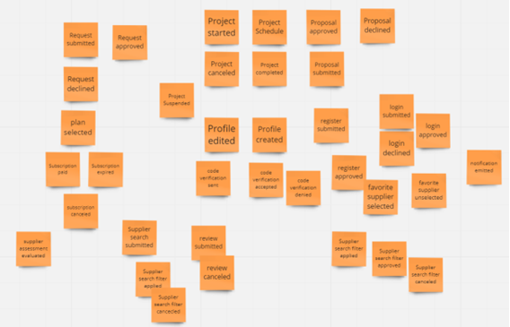
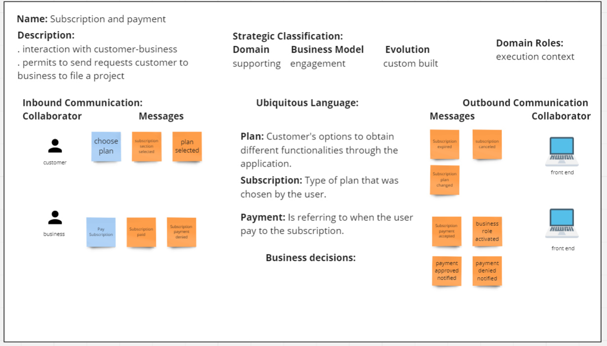
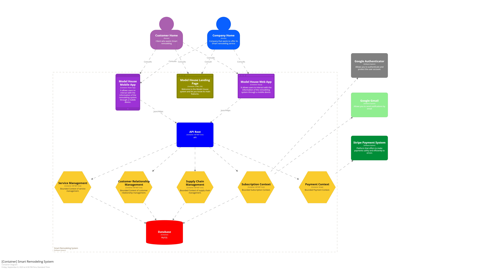

## **UNIT IV**

---

# Strategic-Level Software Design

## 4.1. Strategic-Level Attribute-Driven Design

### 4.1.1. Design Purpose

El propósito del sistema es desarrollar una aplicación web que facilite la interconexión entre empresas especializadas en diseño de interiores y potenciales clientes interesados en solicitar dichos servicios. Con este objetivo en mente, se ha concebido una aplicación que proporciona funcionalidades específicas para cumplir con esta finalidad.

### 4.1.2. Attribute-Driven Design Inputs

##### 4.1.2.1. Primary Functionality (Primary User Stories)

En esta sección se especifica los Epics o User stories que tienen mayor relevancia en términos de requisitos funcionales y que tienen impacto sobre la arquitectura de la solución. La sección inicia con una introducción que resume los requisitos seleccionados y a continuación se detalla los mismos utilizando el siguiente cuadro.

| User Story ID | Título                                                       | Descripción                                                                                                                                                             | Criterios de Aceptación                                                                                                                                                                                                                                                                                                                                                                                                                                                                                                                            |
| ------------- | ------------------------------------------------------------ | ----------------------------------------------------------------------------------------------------------------------------------------------------------------------- | -------------------------------------------------------------------------------------------------------------------------------------------------------------------------------------------------------------------------------------------------------------------------------------------------------------------------------------------------------------------------------------------------------------------------------------------------------------------------------------------------------------------------------------------------- |
| US01          | Visualizar las empresas de remodelación                      | Como visitante, quiero ver un catálogo de empresas de remodelación disponibles en mi área...                                                                            | **Escenario 1:** Verificación de la lista de empresas de remodelación disponibles  - El visitante visualiza una lista de 10 empresas de remodelación registradas disponibles.   **Escenario 2:** Verificación de la funcionalidad de búsqueda avanzada.  - El visitante puede aplicar una búsqueda avanzada y ver una lista de empresas de remodelación avanzada.                                                                                                                                                                         |
| US02          | Registro en la aplicación                                    | Como usuario, quiero crearme una cuenta para tener acceso a las funcionalidades y servicios del sitio web.                                                              | **Escenario 1:** Usuario se registra exitosamente  - El usuario completa el registro con éxito y ve la página principal.   **Escenario 2:** Intento de registro de usuario fallido  - El usuario recibe un mensaje de error si hay un error en al menos uno de los campos.                                                                                                                                                                                                                                                                |
| US03          | Acceso al perfil empresa                                     | Como representante de la empresa, quiero crear un perfil empresa para acceder a funciones adicionales...                                                                | **Escenario 1:** Crear un perfil empresa  - El representante paga el plan de suscripción seleccionado y ve su perfil de empresa.   **Escenario 2:** Intento fallido en la creación de perfil de empresa  - El representante recibe un mensaje de error de pago si el pago es rechazado.                                                                                                                                                                                                                                                   |
| US04          | Publicación de proyectos realizados                          | Como representante de la empresa, quiero publicar fotos y descripciones sobre proyectos realizados...                                                                   | **Escenario 1:** La empresa sube sus proyectos pasados  - El representante publica fotos y descripciones de proyectos y ve un mensaje de éxito.   **Escenario 2:** Los proyectos de la empresa son visitados  - Otros usuarios pueden ver los proyectos publicados en el perfil de la empresa.                                                                                                                                                                                                                                            |
| US05          | Envío de formulario de reclamo                               | Como cliente, quiero subir un reclamo en línea si no estoy satisfecho con el servicio recibido...                                                                       | **Escenario 1:** Formulario de reclamo enviado exitosamente  - El cliente completa y envía el formulario de reclamo con éxito.   **Escenario 2:** Error al enviar el formulario de reclamo  - El cliente recibe un mensaje de error si no completa todos los campos requeridos.                                                                                                                                                                                                                                                           |
| US06          | Visualizar los comentarios de otros clientes                 | Como cliente, quiero leer las reseñas que otros usuarios han publicado...                                                                                               | **Escenario 1:** El cliente visualiza los comentarios de otros clientes  - El cliente puede ver una lista de comentarios sobre la empresa seleccionada.   **Escenario 2:** El cliente no visualiza los comentarios de otros clientes  - El cliente ve una lista de comentarios de la empresa seleccionada vacía con un mensaje.                                                                                                                                                                                                           |
| US07          | Enviar una petición a una empresa                            | Como cliente, quiero enviar una solicitud de servicio a una empresa para obtener servicios específicos que necesito.                                                    | **Escenario 1:** Generando una solicitud de servicio a la empresa seleccionada  - El cliente completa el formulario de solicitud correctamente y lo envía con éxito.   **Escenario 2:** Fallo en la generación de solicitud de servicio a la empresa seleccionada  - El cliente recibe un mensaje de error si no completa correctamente el formulario.   **Escenario 3:** Opción de generar una solicitud de servicio a la empresa seleccionada bloqueada  - El visitante debe iniciar sesión antes de poder generar una solicitud. |
| US08          | Poder recibir, aceptar o denegar los pedidos de mis clientes | Como representante de la empresa, quiero recibir, aceptar o denegar las solicitudes de servicio de mis posibles clientes...                                             | **Escenario 1:** Recibir solicitudes de servicio de remodelación  - El representante puede visualizar el detalle de las solicitudes de servicio recibidas.   **Escenario 2:** Aceptar solicitudes de servicio de remodelación  - El representante puede aceptar una solicitud y enviar una notificación.   **Escenario 3:** Denegar solicitudes de servicio de remodelación  - El representante puede denegar una solicitud y enviar una notificación.                                                                              |
| US09          | Cambiar el estado del proceso de servicio                    | Como representante de la empresa, quiero cambiar el estado del proceso del proyecto para informar al cliente el avance hasta su finalización del servicio...            | **Escenario 1:** Cambio de estado de proyecto exitoso  - El representante puede cambiar el estado del proyecto y enviar una notificación.   **Escenario 2:** Cambio de estado de proyecto fallido  - El representante recibe un mensaje de error si no tiene autorización para modificar el estado.                                                                                                                                                                                                                                       |
| US10          | Recibir las notificaciones de servicio                       | Como empresa o cliente, quiero recibir notificaciones para estar al tanto del proceso del proyecto y alarmarme por cualquier inconveniente...                           | **Escenario 1:** Ingresa a la sección notificaciones  - Los usuarios pueden ver una lista de notificaciones y sus detalles.   **Escenario 2:** Ingresa a la sección de notificaciones vacía  - Los usuarios pueden ver una lista vacía de notificaciones con un mensaje.                                                                                                                                                                                                                                                                  |
| US11          | Tener una sección de favoritos de mis empresas               | Como cliente, quiero poder seleccionar empresas y guardarlas como favoritas para acceder más rápido a ellas en el futuro...                                             | **Escenario 1:** Guarda una empresa como favorito  - El cliente agrega una empresa como favorita y recibe un mensaje de agregado.   **Escenario 2:** Remueve a una empresa como favorito  - El cliente elimina una empresa de su lista de favoritos y recibe un mensaje de removido.                                                                                                                                                                                                                                                      |
| US12          | Visualizar mis tarjetas de pagos                             | Como usuario, quiero visualizar mis tarjetas de pago donde previamente realicé un pago con esa tarjeta...                                                               | **Escenario 1:** Visualiza el método de pago anteriormente ingresado  - El usuario puede ver su método de pago registrado.   **Escenario 2:** No visualiza el método de pago anteriormente ingresado  - El usuario no tiene un método de pago registrado y ve un mensaje.                                                                                                                                                                                                                                                                 |
| US13          | Filtro en la búsqueda de empresas                            | Como cliente, quiero filtrar las empresas usando ciertos criterios en mi búsqueda para encontrar rápidamente las empresas que cumplan con mis requisitos específicos... | **Escenario 1:** Se usa el filtro de búsqueda para encontrar a una empresa  - El cliente puede filtrar la búsqueda por criterios específicos.   **Escenario 2:** Modifica el filtro de búsqueda para encontrar a una empresa  - El cliente puede modificar el filtro y ver la lista actualizada de empresas.                                                                                                                                                                                                                              |
| US14          | Poder editar mi perfil empresa                               | Como representante de la empresa, quiero editar los datos de mi perfil para que me puedan contactar correctamente usando los datos actualizados...                      | **Escenario 1:** Editar la empresa publicada con datos válidos  - El representante edita su perfil con datos válidos y ve un mensaje de edición exitosa.   **Escenario 2:** Editar la empresa publicada con datos inválidos  - El representante recibe un mensaje de error si edita con datos inválidos.                                                                                                                                                                                                                                  |
| US15          | Visualizar los detalles del proceso de servicio              | Como cliente, quiero visualizar los detalles completos del proceso de servicio para conocer todos los aspectos del servicio...                                          | **Escenario 1:** Revisa la propuesta  - El cliente puede revisar la propuesta y aprobarla.                                                                                                                                                                                                                                                                                                                                                                                                                                                      |
| US16          | Calificar una empresa                                        | Como cliente, quiero calificar a una empresa de remodelación al finalizar el proyecto en función a mi experiencia personal...                                           | **Escenario 1:** Calificar un servicio  - El cliente puede calificar una empresa seleccionando una cantidad de estrellas.                                                                                                                                                                                                                                                                                                                                                                                                                       |
| US17          | Seleccionar el plan de suscripción                           | Como usuario, quiero seleccionar un plan de suscripción que mejor se adapte de acuerdo con mis necesidades...                                                           | **Escenario 1:** Ingresa correctamente su información de pago  - El usuario selecciona un plan de suscripción y completa los datos de pago correctamente.   **Escenario 2:** Ingresa incorrectamente su información de pago  - El usuario recibe un mensaje de error si ingresa incorrectamente los datos de pago.                                                                                                                                                                                                                        |
| US18          | Modificar el plan de suscripción                             | Como usuario, quiero modificar mi plan de suscripción para que se adecúe mejor a mis necesidades y presupuesto...                                                       | **Escenario 1:** Selecciona un nuevo plan de suscripción  - El usuario cambia su plan de suscripción y recibe una notificación de confirmación.   **Escenario 2:** Selecciona el mismo plan de suscripción que tiene en el presente  - El usuario recibe un mensaje de que debe seleccionar otro plan si elige el mismo.                                                                                                                                                                                                                  |
| US19          | Gestionar el plan de suscripción                             | Como usuario quiero gestionar mi plan de suscripción para estar pendiente de este y las garantías que aún tengo disponibles...                                          | **Escenario 1:** Ver plan de suscripción  - El usuario puede ver los detalles de su plan de suscripción y el historial de pagos.   **Escenario 2:** Información acerca de sus servicios técnicos  - El usuario puede ver información sobre los servicios técnicos recibidos y disponibles.                                                                                                                                                                                                                                                |
| US20          | Gestionar los dispositivos SmartHome                         | Como empresa quiero tener un registro y análisis de los dispositivos SmartHome instalados...                                                                            | **Escenario 1:** Ingreso a la sección de tu progreso y te muestra los gráficos respectivos  - La empresa puede ver gráficos de crecimiento.   **Escenario 2:** Ingreso a la sección de tu progreso y no se ha tenido ningún progreso  - La empresa recibe un aviso de continuar usando la aplicación.                                                                                                                                                                                                                                     |
| US21          | Sistema de programación de luces                             | Como usuario, quiero poder programar horarios específicos para el encendido y apagado de las luces de mi espacio de trabajo...                                          | **Escenario 1:** Configuración de horarios de encendido y apagado  - El usuario puede configurar horarios para las luces.   **Escenario 2:** Ejecución automática de horarios programados  - Las luces se encienden o apagan automáticamente según la programación.                                                                                                                                                                                                                                                                       |
| US22          | Sistema de Luces                                             | Como usuario, quiero controlar las luces de mi hogar de forma remota a través de una aplicación en mi teléfono...                                                       | **Escenario 1:** Control remoto efectivo de las luces  - El usuario puede encender, apagar o ajustar la intensidad de las luces de su hogar de forma remota.   **Escenario 2:** Encendido remoto de luces antes de llegar a casa  - El usuario puede encender las luces antes de llegar a casa.                                                                                                                                                                                                                                           |
| US23          | Generación Rápida de Propuestas                              | Como empresa, quiero que la IA sugiera automáticamente materiales y colores adecuados para un proyecto de remodelación...                                               | **Escenario 1:** Sugerencias precisas de materiales y colores  - La IA realiza sugerencias precisas basadas en las preferencias del cliente.   **Escenario 2:** Personalización de sugerencias basadas en las preferencias del cliente  - El empleado puede personalizar las sugerencias de la IA según las preferencias del cliente.                                                                                                                                                                                                     |
| US24          | Propuestas de Remodelación Instantáneas                      | Como usuario cliente, quiero una herramienta en línea que me ayude a crear una lista de deseos para mi proyecto...                                                      | **Escenario 1:** Actualización automática de la propuesta al realizar cambios en la lista de deseos  - La IA actualiza automáticamente la propuesta al realizar cambios en la lista de deseos.   **Escenario 2:** Visualización clara de costos y alcance en la propuesta preliminar  - El cliente ve los costos y el alcance del proyecto en la propuesta preliminar de manera clara y comprensible.                                                                                                                                     |
| TS01          | Recopilar información de los dispositivos Smart Home         | Como desarrollador, quiero poder definir un esquema de datos para almacenar los datos recopilados de los dispositivos Smart Home...                                     | **Escenario 1:** Acceso a los datos recopilados de los dispositivos Smart Home  - Los datos recopilados se almacenan en un esquema de datos coherente y se pueden acceder de manera efectiva.   **Escenario 2:** Almacenamiento de los datos recopilados de los dispositivos Smart Home  - Los datos recopilados se almacenan correctamente en la base de datos y se pueden recuperar con precisión.                                                                                                                                      |

              4.1.2.2. Quality attribute Scenarios

| Atributo          | Fuente                                           | Estímulo                                            | Artefacto                                      | Entorno                                               | Respuesta                                                         | Medida                                                                                               |
| ----------------- | ------------------------------------------------ | --------------------------------------------------- | ---------------------------------------------- | ----------------------------------------------------- | ----------------------------------------------------------------- | ---------------------------------------------------------------------------------------------------- |
| Disponibilidad    | Usuarios o clientes                              | Intento de acceso al sistema                        | Sistema de software                            | Hardware y software subyacente                        | El sistema está disponible y responde a las solicitudes           | Tiempo en línea, porcentaje de tiempo disponible, tiempo de inactividad planificado o no planificado |
| Portabilidad      | Usuarios y equipos de desarrollo                 | Intento de ejecución en diferentes plataformas      | Software o aplicación                          | Diferentes sistemas operativos o entornos de hardware | El software se ejecuta correctamente en diferentes entornos       | Número de plataformas compatibles, problemas de compatibilidad reportados                            |
| Funcionalidad     | Requisitos del cliente                           | Acciones del usuario o eventos del sistema          | Funcionalidades y características del software | Contexto de uso                                       | El software realiza las funciones especificadas                   | Requisitos funcionales cumplidos, errores funcionales, casos de uso exitosos                         |
| Confiabilidad     | Usuarios y clientes                              | Uso normal o inusual del software                   | Sistema de software                            | Condiciones operativas                                | El software se comporta de manera predecible y sin errores graves | Tiempo promedio entre fallas, tasa de errores, disponibilidad                                        |
| Seguridad         | Usuarios y equipos de seguridad                  | Intentos de acceso no autorizado o amenazas         | Sistema de seguridad y software                | Redes y sistemas de comunicación                      | Protección de datos y recursos frente a amenazas                  | Nivel de vulnerabilidades, incidentes de seguridad, políticas de acceso                              |
| Usabilidad        | Usuarios y diseñadores de experiencia de usuario | Interacción del usuario con la interfaz             | Interfaz de usuario                            | Contexto de uso                                       | Facilidad de uso, satisfacción del usuario                        | Evaluaciones de usabilidad, encuestas de satisfacción del usuario, tasa de errores de usuario        |
| Modificabilidad   | Equipos de desarrollo y mantenimiento            | Cambios en los requisitos o actualizaciones         | Código fuente y diseño del software            | Entorno de desarrollo                                 | Capacidad para realizar cambios sin introducir errores            | Tiempo y costo de implementación de cambios, estabilidad del sistema                                 |
| Interoperabilidad | Usuarios y sistemas externos                     | Intercambio de datos o servicios con otros sistemas | Interfaces de comunicación y protocolos        | Sistemas externos con los que interactúa              | Capacidad para trabajar con otros sistemas de manera efectiva     | Grado de compatibilidad con estándares, éxito en la integración con sistemas externos                |
| Rendimiento       | Usuarios y requisitos de rendimiento             | Carga de trabajo o solicitudes de usuario           | Sistema de software y hardware                 | Recursos de hardware y red                            | Capacidad de respuesta y eficiencia del software bajo carga       | Tiempo de respuesta, throughput, utilización de recursos, capacidad de escalabilidad                 |

#### 4.1.2.3. Constraints
### 4.1.3. Architectural Drivers Backlog
### 4.1.4. Architectural Design Decisions
### 4.1.5. Quality Attribute Scenario Refinements
<table>
    <tr>
        <td colspan=8>Scenario Refinement for Scenario 1</td>
    <tr>
    <tr>
        <td colspan=4>Scenario(s):</td>
        <td colspan=4>Un usuario intenta acceder al sistema y el sistema está disponible.</td>
    </tr>
    <tr>
        <td colspan=4>Business Goals:</td>
        <td colspan=4>El sistema debe estar disponible para los usuarios cuando lo necesiten para que puedan realizar sus tareas.</td>
    </tr>
    <tr>
        <td colspan=4>Relevant Quality Attributes:</td>
        <td colspan=4>Disponibilidad</td>
    </tr>
    <tr>    
        <td colspan=2 rowspan=6>Scenario Components</td>
        <td colspan=2>Stimulus:</td>
        <td colspan=4>Usuarios o clientes</td>
    </tr>
    <tr>
        <td colspan=2>Stimulus Source:</td>
        <td colspan=4>Intento de acceso al sistema</td>
    </tr>
    <tr>
        <td colspan=2>Environment:</td>
        <td colspan=4>Sistema de software</td>
    </tr>
    <tr>
        <td colspan=2>Artifact (if Known)</td>
        <td colspan=4>Hardware y software subyacente</td>
    </tr>
    <tr>
        <td colspan=2>Response:</td>
        <td colspan=4>El sistema está disponible y responde a las solicitudes.</td>
    </tr>
    <tr>
        <td colspan=2>Response Measure:</td>
        <td colspan=4>Tiempo en línea, porcentaje de tiempo disponible, tiempo de inactividad planificado o no planificado</td>
    </tr>
    <tr>
        <td colspan=4>Questions:</td>
        <td colspan=4>¿El sistema está disponible el 99,9% del tiempo?</td>
    </tr>
    <tr>
        <td colspan=4>Issues:</td>
        <td colspan=4>¿El sistema responde a las solicitudes de los usuarios dentro de un tiempo razonable?</td>
    </tr>    
</table>

<table>
    <tr>
        <td colspan=8>Scenario Refinement for Scenario 2</td>
    <tr>
    <tr>
        <td colspan=4>Scenario(s):</td>
        <td colspan=4>Un usuario intenta ejecutar el software en una plataforma diferente y el software se ejecuta correctamente.</td>
    </tr>
    <tr>
        <td colspan=4>Business Goals:</td>
        <td colspan=4>El sistema debe poder ejecutarse en diferentes plataformas para que pueda ser utilizado por un público más amplio.</td>
    </tr>
    <tr>
        <td colspan=4>Relevant Quality Attributes:</td>
        <td colspan=4>Portabilidad</td>
    </tr>
    <tr>    
        <td colspan=2 rowspan=6>Scenario Components</td>
        <td colspan=2>Stimulus:</td>
        <td colspan=4>Usuarios y equipos de desarrollo</td>
    </tr>
    <tr>
        <td colspan=2>Stimulus Source:</td>
        <td colspan=4>Intento de ejecución en diferentes plataformas</td>
    </tr>
    <tr>
        <td colspan=2>Environment:</td>
        <td colspan=4>Software o aplicación</td>
    </tr>
    <tr>
        <td colspan=2>Artifact (if Known)</td>
        <td colspan=4>Diferentes sistemas operativos o entornos de hardware</td>
    </tr>
    <tr>
        <td colspan=2>Response:</td>
        <td colspan=4>El software se ejecuta correctamente en diferentes entornos.</td>
    </tr>
    <tr>
        <td colspan=2>Response Measure:</td>
        <td colspan=4>Número de plataformas compatibles, problemas de compatibilidad reportados</td>
    </tr>
    <tr>
        <td colspan=4>Questions:</td>
        <td colspan=4>¿El software es compatible con los sistemas operativos y entornos de hardware más comunes?</td>
    </tr>
    <tr>
        <td colspan=4>Issues:</td>
        <td colspan=4>¿El software se ejecuta sin problemas en diferentes entornos?</td>
    </tr>    
</table>

<table>
    <tr>
        <td colspan=8>Scenario Refinement for Scenario 3</td>
    <tr>
    <tr>
        <td colspan=4>Scenario(s):</td>
        <td colspan=4>Un usuario intenta realizar una tarea y el software realiza la tarea correctamente.</td>
    </tr>
    <tr>
        <td colspan=4>Business Goals:</td>
        <td colspan=4>El sistema debe cumplir con los requisitos funcionales para que los usuarios puedan realizar sus tareas de manera eficiente.</td>
    </tr>
    <tr>
        <td colspan=4>Relevant Quality Attributes:</td>
        <td colspan=4>Funcionalidad</td>
    </tr>
    <tr>    
        <td colspan=2 rowspan=6>Scenario Components</td>
        <td colspan=2>Stimulus:</td>
        <td colspan=4>Requisitos del cliente</td>
    </tr>
    <tr>
        <td colspan=2>Stimulus Source:</td>
        <td colspan=4>Acciones del usuario o eventos del sistema</td>
    </tr>
    <tr>
        <td colspan=2>Environment:</td>
        <td colspan=4>Funcionalidades y características del software</td>
    </tr>
    <tr>
        <td colspan=2>Artifact (if Known)</td>
        <td colspan=4>Contexto de uso</td>
    </tr>
    <tr>
        <td colspan=2>Response:</td>
        <td colspan=4>El software realiza las funciones especificadas.</td>
    </tr>
    <tr>
        <td colspan=2>Response Measure:</td>
        <td colspan=4>Requisitos funcionales cumplidos, errores funcionales, casos de uso exitosos</td>
    </tr>
    <tr>
        <td colspan=4>Questions:</td>
        <td colspan=4>¿El software cumple con todos los requisitos funcionales?</td>
    </tr>
    <tr>
        <td colspan=4>Issues:</td>
        <td colspan=4>¿El software realiza todas las tareas esperadas por los usuarios?</td>
    </tr>    
</table>

<table>
    <tr>
        <td colspan=8>Scenario Refinement for Scenario 4</td>
    <tr>
    <tr>
        <td colspan=4>Scenario(s):</td>
        <td colspan=4>Un usuario intenta usar el software y el software funciona correctamente.</td>
    </tr>
    <tr>
        <td colspan=4>Business Goals:</td>
        <td colspan=4>El sistema debe ser estable y libre de errores para que los usuarios puedan confiar en él.</td>
    </tr>
    <tr>
        <td colspan=4>Relevant Quality Attributes:</td>
        <td colspan=4>Confiabilidad</td>
    </tr>
    <tr>    
        <td colspan=2 rowspan=6>Scenario Components</td>
        <td colspan=2>Stimulus:</td>
        <td colspan=4>Usuarios y clientes</td>
    </tr>
    <tr>
        <td colspan=2>Stimulus Source:</td>
        <td colspan=4>Uso normal o inusual del software</td>
    </tr>
    <tr>
        <td colspan=2>Environment:</td>
        <td colspan=4>Sistema de software</td>
    </tr>
    <tr>
        <td colspan=2>Artifact (if Known)</td>
        <td colspan=4>Condiciones operativas</td>
    </tr>
    <tr>
        <td colspan=2>Response:</td>
        <td colspan=4>El software se comporta de manera predecible y sin errores graves.</td>
    </tr>
    <tr>
        <td colspan=2>Response Measure:</td>
        <td colspan=4>Tiempo promedio entre fallas, tasa de errores, disponibilidad</td>
    </tr>
    <tr>
        <td colspan=4>Questions:</td>
        <td colspan=4>¿El software es confiable en uso normal?</td>
    </tr>
    <tr>
        <td colspan=4>Issues:</td>
        <td colspan=4>¿El software puede soportar el uso inusual?</td>
    </tr>    
</table>

<table>
    <tr>
        <td colspan=8>Scenario Refinement for Scenario 5</td>
    <tr>
    <tr>
        <td colspan=4>Scenario(s):</td>
        <td colspan=4>Un usuario intenta acceder al sistema de forma no autorizada y el sistema se protege contra el acceso no autorizado.</td>
    </tr>
    <tr>
        <td colspan=4>Business Goals:</td>
        <td colspan=4>El sistema debe proteger los datos y recursos del sistema de amenazas para que los usuarios puedan sentirse seguros al usarlo.</td>
    </tr>
    <tr>
        <td colspan=4>Relevant Quality Attributes:</td>
        <td colspan=4>Seguridad</td>
    </tr>
    <tr>    
        <td colspan=2 rowspan=6>Scenario Components</td>
        <td colspan=2>Stimulus:</td>
        <td colspan=4>Usuarios y equipos de seguridad</td>
    </tr>
    <tr>
        <td colspan=2>Stimulus Source:</td>
        <td colspan=4>Intentos de acceso no autorizado o amenazas</td>
    </tr>
    <tr>
        <td colspan=2>Environment:</td>
        <td colspan=4>Sistema de seguridad y software</td>
    </tr>
    <tr>
        <td colspan=2>Artifact (if Known)</td>
        <td colspan=4>Redes y sistemas de comunicación</td>
    </tr>
    <tr>
        <td colspan=2>Response:</td>
        <td colspan=4>Protección de datos y recursos frente a amenazas.</td>
    </tr>
    <tr>
        <td colspan=2>Response Measure:</td>
        <td colspan=4>Nivel de vulnerabilidades, incidentes de seguridad, políticas de acceso</td>
    </tr>
    <tr>
        <td colspan=4>Questions:</td>
        <td colspan=4>¿El sistema está protegido contra ataques externos?</td>
    </tr>
    <tr>
        <td colspan=4>Issues:</td>
        <td colspan=4>¿Los datos y recursos del sistema están seguros?</td>
    </tr>    
</table>

<table>
    <tr>
        <td colspan=8>Scenario Refinement for Scenario 6</td>
    <tr>
    <tr>
        <td colspan=4>Scenario(s):</td>
        <td colspan=4>Un usuario intenta usar la interfaz de usuario y la interfaz de usuario es fácil de usar.</td>
    </tr>
    <tr>
        <td colspan=4>Business Goals:</td>
        <td colspan=4>La interfaz de usuario debe ser fácil de aprender y usar para que los usuarios puedan interactuar con el sistema de manera eficiente.</td>
    </tr>
    <tr>
        <td colspan=4>Relevant Quality Attributes:</td>
        <td colspan=4>Usabilidad</td>
    </tr>
    <tr>    
        <td colspan=2 rowspan=6>Scenario Components</td>
        <td colspan=2>Stimulus:</td>
        <td colspan=4>Usuarios y diseñadores de experiencia de usuario</td>
    </tr>
    <tr>
        <td colspan=2>Stimulus Source:</td>
        <td colspan=4>Interacción del usuario con la interfaz</td>
    </tr>
    <tr>
        <td colspan=2>Environment:</td>
        <td colspan=4>Interfaz de usuario</td>
    </tr>
    <tr>
        <td colspan=2>Artifact (if Known)</td>
        <td colspan=4>Contexto de uso</td>
    </tr>
    <tr>
        <td colspan=2>Response:</td>
        <td colspan=4>Facilidad de uso, satisfacción del usuario</td>
    </tr>
    <tr>
        <td colspan=2>Response Measure:</td>
        <td colspan=4>Evaluaciones de usabilidad, encuestas de satisfacción del usuario, tasa de errores de usuario</td>
    </tr>
    <tr>
        <td colspan=4>Questions:</td>
        <td colspan=4>¿La interfaz de usuario es fácil de usar?</td>
    </tr>
    <tr>
        <td colspan=4>Issues:</td>
        <td colspan=4>¿Los usuarios están satisfechos con la interfaz de usuario?</td>
    </tr>    
</table>

<table>
    <tr>
        <td colspan=8>Scenario Refinement for Scenario 7</td>
    <tr>
    <tr>
        <td colspan=4>Scenario(s):</td>
        <td colspan=4>Un equipo de desarrollo necesita cambiar el software y el software es fácil de modificar.</td>
    </tr>
    <tr>
        <td colspan=4>Business Goals:</td>
        <td colspan=4>El sistema debe ser fácil de cambiar para adaptarse a los nuevos requisitos para que pueda mantenerse actualizado y relevante.</td>
    </tr>
    <tr>
        <td colspan=4>Relevant Quality Attributes:</td>
        <td colspan=4>Modificabilidad</td>
    </tr>
    <tr>    
        <td colspan=2 rowspan=6>Scenario Components</td>
        <td colspan=2>Stimulus:</td>
        <td colspan=4>Usuarios o clientes</td>
    </tr>
    <tr>
        <td colspan=2>Stimulus Source:</td>
        <td colspan=4>Intento de acceso al sistema</td>
    </tr>
    <tr>
        <td colspan=2>Environment:</td>
        <td colspan=4>Sistema de software</td>
    </tr>
    <tr>
        <td colspan=2>Artifact (if Known)</td>
        <td colspan=4>Hardware y software subyacente</td>
    </tr>
    <tr>
        <td colspan=2>Response:</td>
        <td colspan=4>El sistema está disponible y responde a las solicitudes.</td>
    </tr>
    <tr>
        <td colspan=2>Response Measure:</td>
        <td colspan=4>Tiempo en línea, porcentaje de tiempo disponible, tiempo de inactividad planificado o no planificado</td>
    </tr>
    <tr>
        <td colspan=4>Questions:</td>
        <td colspan=4>¿El sistema está disponible el 99,9% del tiempo?</td>
    </tr>
    <tr>
        <td colspan=4>Issues:</td>
        <td colspan=4>¿El sistema responde a las solicitudes de los usuarios dentro de un tiempo razonable?</td>
    </tr>    
</table>

<table>
    <tr>
        <td colspan=8>Scenario Refinement for Scenario 8</td>
    <tr>
    <tr>
        <td colspan=4>Scenario(s):</td>
        <td colspan=4>Un equipo de desarrollo necesita realizar un cambio en el software y el software es fácil de modificar.</td>
    </tr>
    <tr>
        <td colspan=4>Business Goals:</td>
        <td colspan=4>El sistema debe ser fácil de modificar para que los equipos de desarrollo puedan realizar cambios de manera rápida y eficiente.</td>
    </tr>
    <tr>
        <td colspan=4>Relevant Quality Attributes:</td>
        <td colspan=4>Disponibilidad</td>
    </tr>
    <tr>    
        <td colspan=2 rowspan=6>Scenario Components</td>
        <td colspan=2>Stimulus:</td>
        <td colspan=4>Equipos de desarrollo y mantenimiento</td>
    </tr>
    <tr>
        <td colspan=2>Stimulus Source:</td>
        <td colspan=4>Cambios en los requisitos o actualizaciones</td>
    </tr>
    <tr>
        <td colspan=2>Environment:</td>
        <td colspan=4>Código fuente y diseño del software</td>
    </tr>
    <tr>
        <td colspan=2>Artifact (if Known)</td>
        <td colspan=4>Entorno de desarrollo</td>
    </tr>
    <tr>
        <td colspan=2>Response:</td>
        <td colspan=4>Capacidad para realizar cambios sin introducir errores</td>
    </tr>
    <tr>
        <td colspan=2>Response Measure:</td>
        <td colspan=4>Tiempo y costo de implementación de cambios, estabilidad del sistema</td>
    </tr>
    <tr>
        <td colspan=4>Questions:</td>
        <td colspan=4>¿El software es fácil de modificar?</td>
    </tr>
    <tr>
        <td colspan=4>Issues:</td>
        <td colspan=4>¿Los cambios al software son propensos a introducir errores?</td>
    </tr>    
</table>

<table>
    <tr>
        <td colspan=8>Scenario Refinement for Scenario 9</td>
    <tr>
    <tr>
        <td colspan=4>Scenario(s):</td>
        <td colspan=4>Un usuario intenta intercambiar datos o servicios con otro sistema y el software es capaz de hacerlo de manera efectiva.</td>
    </tr>
    <tr>
        <td colspan=4>Business Goals:</td>
        <td colspan=4>El sistema debe ser capaz de interactuar con otros sistemas de manera efectiva para que los usuarios puedan realizar sus tareas.</td>
    </tr>
    <tr>
        <td colspan=4>Relevant Quality Attributes:</td>
        <td colspan=4>Interoperabilidad</td>
    </tr>
    <tr>    
        <td colspan=2 rowspan=6>Scenario Components</td>
        <td colspan=2>Stimulus:</td>
        <td colspan=4>Usuarios y sistemas externos</td>
    </tr>
    <tr>
        <td colspan=2>Stimulus Source:</td>
        <td colspan=4>Intercambio de datos o servicios con otros sistemas</td>
    </tr>
    <tr>
        <td colspan=2>Environment:</td>
        <td colspan=4>Interfaces de comunicación y protocolos</td>
    </tr>
    <tr>
        <td colspan=2>Artifact (if Known)</td>
        <td colspan=4>Sistemas externos con los que interactúa</td>
    </tr>
    <tr>
        <td colspan=2>Response:</td>
        <td colspan=4>Capacidad para trabajar con otros sistemas de manera efectiva</td>
    </tr>
    <tr>
        <td colspan=2>Response Measure:</td>
        <td colspan=4>Grado de compatibilidad con estándares, éxito en la integración con sistemas externos</td>
    </tr>
    <tr>
        <td colspan=4>Questions:</td>
        <td colspan=4>¿El software puede interactuar con otros sistemas de manera efectiva?</td>
    </tr>
    <tr>
        <td colspan=4>Issues:</td>
        <td colspan=4>¿El software requiere una integración compleja con otros sistemas?</td>
    </tr>    
</table>

## 4.2 Strategic Level Domain Driver Design
### 4.2.1 EventStorming
Se identificaron los eventos y bounded context correspondientes al realizar el proceso del ventStorming
    

            
    

### 4.2.2 Candidate Context Discovery
Al realizar el proceso de EventStorming se identificaron 11 Bounded Context. Siendo "Request Service Management" el core de negocio encontrado.

### 4.2.3 Domain Message Flows Modeling
Se identificaron los pasos o actividades que los usuarios tendrán que realizar al encontrarse con los escenarios propuestos al navegar por la aplicación.

### 4.2.4 Bounded Context Canvases
Se realizaron los siguientes canvases:

### 4.2.5 Context Mapping
El context mapping que se ha creado es el siguiente:

## 4.3 Software Architecture

### 4.3.1. Software Architecture System Landscape Diagram.

### 4.3.2. Software Architecture Context Level Diagrams.

### 4.3.3. Software Architecture Container Level Diagrams.

### 4.3.4. Software Architecture Deployment Diagrams.

