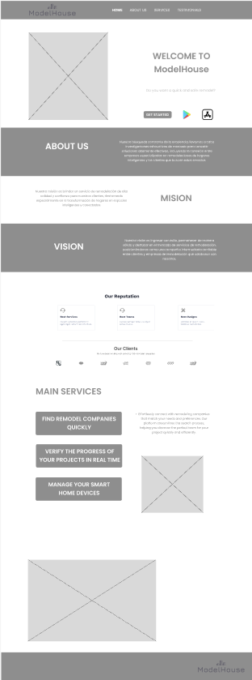

## **UNIT VI**

---

### Solution UX Design

#### 6.1. Style Guidelines

##### 6.1.1. General Style Guidelines

 Los Style Guidelines para Lean UX representan un conjunto de reglas y directrices esenciales aplicadas para mantener una coherencia visual y estilística en el diseño de la interfaz de usuario en proyectos de Lean UX. En términos de la paleta de colores recomendada, se establece lo siguiente:

<li align = justify> <b>Color Principal (#007A84): </b>Este color se utiliza para resaltar elementos importantes y atraer la atención del usuario. 
</li>

    

        
    

<li align = justify> <b>Fondo (#004A63): </b>Se emplea para el fondo de la interfaz, proporcionando un contraste visual con el color principal y garantizando una fácil legibilidad del texto. </li>

    

        
    

<li align = justify> <b>Color Secundario (#152031): </b>Este tono se aplica a elementos de texto y otros componentes gráficos que requieren una menor atención por parte del usuario.</li>

    

        
    

<li align = justify> <b>Colores de Destaque (#F9F871, #86D57C, #02AA8B): </b>Estos colores se reservan para resaltar elementos secundarios de la interfaz, como botones o iconos.</li>

    

        
        
        
    

 

Mantener la consistencia en el uso de estos colores a lo largo de la interfaz de usuario es fundamental para garantizar que los usuarios se sientan cómodos al interactuar con la aplicación, lo que contribuye a una experiencia de usuario fluida y coherente. Además de los aspectos relacionados con el color, las directrices de estilo también pueden abarcar recomendaciones sobre tipografía, tamaños de elementos y otros aspectos visuales de la interfaz de usuario.

En cuanto a la elección de fuentes:

<li align = jusitfy><b>Título:</b>Se utiliza la fuente "Archivo".</li>

    

        
    

<li align = jusitfy><b>Texto:</b>La fuente preferida es "Poppins".</li>

    

        
    

 

Estas elecciones tipográficas ayudarán a consolidar aún más la coherencia y la estética deseada en el diseño de la interfaz de usuario.

#### 6.2 Information Architecture

##### 6.2.1. Labeling Systems

- Para el sistema de etiquetado hemos utilizado diferentes formas de etiquetas en un lenguaje sencillo de entender para los usuarios y empresas
  
<table>
  <thead>
    <tr>
      <th>Elemento</th>
      <th>Descripción</th>
    </tr>
  </thead>
  <tbody>
    <tr>
      <td colspan="2"><strong>Inicio de Sesión</strong></td>
    </tr>
    <tr>
      <td>Sign up</td>
      <td>Enlace para registrar una cuenta en la aplicación.</td>
    </tr>
    <tr>
      <td>Login</td>
      <td>Botón para iniciar sesión en la aplicación.</td>
    </tr>
    <tr>
      <td colspan="2"><strong>Panel de Control</strong></td>
    </tr>
    <tr>
      <td>Clientes</td>
      <td>Lista de clientes conectados a la empresa de remodelación.</td>
    </tr>
    <tr>
      <td>Proyectos</td>
      <td>Vista de proyectos de remodelación actuales.</td>
    </tr>
    <tr>
      <td>Dispositivos IoT</td>
      <td>Acceso al control y configuración de dispositivos IoT.</td>
    </tr>
    <tr>
      <td colspan="2"><strong>Gestión de Proyectos</strong></td>
    </tr>
    <tr>
      <td>Crear Proyecto</td>
      <td>Opción para crear un nuevo proyecto de remodelación.</td>
    </tr>
    <tr>
      <td>Detalles del Proyecto</td>
      <td>Visualización de detalles y progreso de un proyecto específico.</td>
    </tr>
    <tr>
      <td>Documentos</td>
      <td>Almacenamiento de documentos relevantes del proyecto.</td>
    </tr>
    <tr>
      <td colspan="2"><strong>Dispositivos IoT</strong></td>
    </tr>
    <tr>
      <td>Agregar Dispositivo</td>
      <td>Función para agregar nuevos dispositivos IoT al proyecto.</td>
    </tr>
    <tr>
      <td>Configuración de Dispositivos</td>
      <td>Ajuste de configuraciones y parámetros de dispositivos IoT.</td>
    </tr>
    <tr>
      <td>Estado de Dispositivos</td>
      <td>Visualización del estado y datos en tiempo real de los dispositivos IoT.</td>
    </tr>
    <tr>
      <td colspan="2"><strong>Comunicación</strong></td>
    </tr>
    <tr>
      <td>Notificaciones</td>
      <td>Recepción de notificaciones y actualizaciones relevantes.</td>
    </tr>
    <tr>
      <td>Informes</td>
      <td>Generación de informes detallados sobre el progreso de proyectos y uso de dispositivos IoT.</td>
    </tr>
    <tr>
      <td>Análisis de Datos IoT</td>
      <td>Herramienta para analizar datos recopilados por dispositivos IoT.</td>
    </tr>
    <tr>
      <td colspan="2"><strong>Configuración de Cuenta</strong></td>
    </tr>
    <tr>
      <td>Perfil</td>
      <td>Edición de información personal y de la empresa.</td>
    </tr>
    <tr>
      <td>Configuración de Dispositivos IoT</td>
      <td>Gestión de dispositivos IoT, integración y seguridad.</td>
    </tr>
    <tr>
      <td colspan="2"><strong>Cerrar Sesión</strong></td>
    </tr>
    <tr>
      <td>Cerrar Sesión</td>
      <td>Botón para salir de la aplicación y finalizar la sesión.</td>
    </tr>
  </tbody>
</table>

##### 6.2.2. Searching Systems

<!DOCTYPE html>
<html lang="es">
<head>
    <meta charset="UTF-8">
    <title>Descripción del Sistema de Búsqueda</title>
</head>
<body>
    <h2>Descripción:</h2>
    
El Sistema de Búsqueda es una función esencial en la aplicación que facilita a los usuarios encontrar empresas de remodelación, proyectos y dispositivos IoT de manera rápida y eficiente. Este sistema está diseñado para mejorar la experiencia del usuario y asegurar que los clientes puedan acceder a la información que necesitan de manera oportuna.

  <h2>Características Clave:</h2>
  <h3>Búsqueda de Empresas de Remodelación:</h3>
  <ul>
        <li>Los clientes pueden buscar empresas de remodelación por nombre, ubicación, especialidad, calificaciones y otros criterios relevantes.</li>
        <li>Se proporcionan filtros avanzados para refinar la búsqueda, como tamaño de proyecto, presupuesto y disponibilidad.</li>
    </ul>
  <h3>Búsqueda de Proyectos de Remodelación:</h3>
    <ul>
        <li>Los clientes pueden buscar proyectos de remodelación activos o pasados utilizando palabras clave, ubicación, tipo de proyecto y más.</li>
        <li>Los filtros permiten a los clientes encontrar proyectos que se ajusten a sus necesidades específicas.</li>
    </ul>
<h3>Búsqueda de Dispositivos IoT:</h3>
    <ul>
        <li>Los usuarios pueden buscar dispositivos IoT disponibles para su uso en proyectos de remodelación.</li>
        <li>Los filtros pueden incluir tipo de dispositivo, compatibilidad, eficiencia energética y otras especificaciones técnicas.</li>
    </ul>
  <h3>Resultados Relevantes:</h3>
    <ul>
        <li>El sistema de búsqueda utiliza algoritmos avanzados para ofrecer resultados relevantes y sugerencias basadas en las consultas de los usuarios.</li>
        <li>Los resultados se presentan en un formato claro y fácil de navegar.</li>
    </ul>
  <h3>Visualización Detallada:</h3>
    <ul>
        <li>Los usuarios pueden acceder a información detallada sobre empresas de remodelación, proyectos y dispositivos IoT, incluyendo calificaciones, reseñas, imágenes y datos técnicos.</li>
    </ul>
  <h3>Gestión de Favoritos</h3>
    <ul>
        <li>Se proporciona un historial de búsqueda de las empresas de remodelación marcadas como favoritos.</li>
    </ul>
  <h3>Alertas y Notificaciones:</h3>
    <ul>
        <li>Los usuarios pueden configurar alertas de búsqueda para recibir notificaciones cuando aparezcan nuevos proyectos o empresas que coincidan con sus criterios.</li>
    </ul>
  <h2>Beneficios:</h2>
    <ul>
        <li>Facilita a los clientes encontrar rápidamente empresas de remodelación y proyectos que se adapten a sus necesidades.</li>
        <li>Ahorra tiempo al proporcionar resultados relevantes y opciones de filtrado.</li>
        <li>Mejora la visibilidad de las empresas de remodelación y los dispositivos IoT disponibles en la plataforma.</li>
        <li>Fomenta la colaboración y la toma de decisiones informadas al proporcionar información detallada y calificaciones.</li>
    </ul>
</body>
</html>

##### 6.2.3. SEO Tags and Meta Tags

<!DOCTYPE html>
<html lang="es">
<head>
    <meta charset="UTF-8">
    <title>Descripción de SEO Tags y Meta Tags</title>
</head>
<body>
<h2>Descripción:</h2>
    
Los SEO Tags y Meta Tags son elementos cruciales para mejorar la visibilidad de la aplicación y aumentar su clasificación en los motores de búsqueda. Estas etiquetas se utilizan para optimizar el contenido y facilitar que los motores de búsqueda, como Google, indexen y comprendan la aplicación. A continuación, se detallan cómo se aplican en el modelo de negocio:

<h2>Características Clave:</h2>
<h3>Optimización de Títulos (Title Tags):</h3>
    <ul>
        <li>Cada página de la aplicación tiene un título único y descriptivo que refleja su contenido.</li>
        <li>Los títulos se ajustan para incluir palabras clave relevantes relacionadas con empresas de remodelación, proyectos y dispositivos IoT.</li>
    </ul>
<h3>Meta Descriptions:</h3>
    <ul>
        <li>Se crean descripciones meta concisas y atractivas para cada página, lo que anima a los usuarios a hacer clic en los resultados del motor de búsqueda.</li>
        <li>Las meta descripciones también incluyen palabras clave relevantes y una breve visión general del contenido.</li>
    </ul>
<h3>Etiquetas de Encabezado (Header Tags):</h3>
    <ul>
        <li>Se utilizan etiquetas de encabezado, como H1, H2 y H3, para estructurar y jerarquizar el contenido de manera lógica.</li>
        <li>Las etiquetas de encabezado ayudan a los motores de búsqueda a comprender la jerarquía de la información y la importancia de cada sección.</li>
    </ul>
<h3>Optimización de Imágenes (Image Alt Tags):</h3>
    <ul>
        <li>Todas las imágenes en la aplicación incluyen etiquetas alt descriptivas que indican el contenido de la imagen.</li>
        <li>Esto mejora la accesibilidad y permite que las imágenes se clasifiquen en las búsquedas de imágenes de Google.</li>
    </ul>
<h3>URLs Amigables para SEO:</h3>
    <ul>
        <li>Las URL de las páginas se diseñan de manera que sean legibles y contengan palabras clave relevantes.</li>
        <li>Las URL amigables para SEO facilitan la indexación y la comprensión del contenido por parte de los motores de búsqueda.</li>
    </ul>
<h3>Sitemap XML:</h3>
    <ul>
        <li>Se genera un mapa del sitio XML que enumera todas las páginas y recursos de la aplicación.</li>
        <li>El mapa del sitio se envía a los motores de búsqueda para ayudarles a rastrear e indexar de manera eficiente el contenido.</li>
    </ul>
<h2>Beneficios:</h2>
    <ul>
        <li>Mejora de la Clasificación en Motores de Búsqueda: La implementación adecuada de SEO Tags y Meta Tags ayuda a la aplicación a aparecer en los resultados de búsqueda de manera más prominente, aumentando la visibilidad y el tráfico.</li>
        <li>Mejora de la Experiencia del Usuario: Al optimizar títulos, descripciones y etiquetas de encabezado, se proporciona a los usuarios una experiencia de búsqueda más informativa y relevante.</li>
        <li>Aumento de Clics: Las meta descripciones bien escritas pueden aumentar la tasa de clics, lo que resulta en más visitantes a la aplicación.</li>
        <li>Indexación Eficiente: Las etiquetas alt de las imágenes y las URL amigables para SEO facilitan que los motores de búsqueda indexen y muestren contenido específico.</li>
        <li>Competitividad en el Mercado: Una estrategia de SEO sólida puede ayudar a la aplicación a competir de manera efectiva en el mercado y atraer a un público más amplio.</li>
    </ul>
</body>
</html>

##### 6.2.4. Navigation Systems

<!DOCTYPE html>
<html lang="es">
<head>
    <meta charset="UTF-8">
    <title>Descripción de Sistemas de Navegación</title>
</head>
<body>
<h2>Descripción:</h2>
    
Los Sistemas de Navegación son una parte esencial de la aplicación que garantiza una experiencia de usuario fluida y eficiente. Estos sistemas facilitan la navegación de los usuarios a través de la aplicación y les ayudan a encontrar rápidamente la información que necesitan. A continuación, se detallan cómo se aplican en el modelo de negocio:

<h2>Características Clave:</h2>
<h3>Menú de Navegación Principal:</h3>
    <ul>
        <li>La aplicación cuenta con un menú de navegación principal que proporciona acceso rápido a las secciones clave, como "Inicio", "Solicitudes", "Dispositivos IoT", "Menú" y más.</li>
        <li>El menú se encuentra en la parte superior o lateral de la interfaz para una fácil accesibilidad.</li>
    </ul>
<h3>Búsqueda Integrada:</h3>
    <ul>
        <li>Se incluye una barra de búsqueda en la parte superior de todas las páginas para permitir a los usuarios buscar empresas de remodelación, proyectos, dispositivos IoT y otros contenidos.</li>
    </ul>
<h3>Navegación por Categorías:</h3>
    <ul>
        <li>Las empresas de remodelación, proyectos y dispositivos IoT se organizan en categorías y subcategorías para facilitar la exploración.</li>
    </ul>
<h3>Páginas de Detalles:</h3>
    <ul>
        <li>Cada empresa de remodelación, proyecto y dispositivo IoT tiene su propia página de detalles con información completa.</li>
        <li>Los usuarios pueden acceder a descripciones detalladas, imágenes, reseñas, calificaciones y datos técnicos.</li>
    </ul>
<h3>Botón de Regreso:</h3>
    <ul>
        <li>En todas las páginas, se incluye un botón de "Regreso" que permite a los usuarios volver atrás en su navegación, lo que facilita la exploración de contenido relacionado.</li>
    </ul>
<h2>Beneficios:</h2>
    <ul>
        <li>Experiencia de Usuario Mejorada: Los sistemas de navegación intuitivos y eficientes hacen que la aplicación sea fácil de usar y atractiva para los usuarios.</li>
        <li>Acceso Rápido a la Información: Los usuarios pueden encontrar rápidamente empresas de remodelación, proyectos y dispositivos IoT relevantes gracias a la navegación bien estructurada.</li>
        <li>Exploración Facilitada: La organización por categorías y subcategorías, así como la navegación por mapa, permiten a los usuarios explorar y descubrir contenido de manera efectiva.</li>
        <li>Mayor Retención de Usuarios: Una navegación fluida y una experiencia positiva del usuario contribuyen a la retención de usuarios y la fidelización.</li>
        <li>Facilita la Toma de Decisiones: Los detalles completos en las páginas de empresas y proyectos ayudan a los usuarios a tomar decisiones informadas.</li>
    </ul>
</body>
</html>

#### 6.3. Landing Page UI Design

- Para la elaboración del landing page hemos utilizado la plataforma “Figma” para facilitar el diseño cooperativo.

##### 6.3.1. Landing Page Wireframe

- Desktop:

    

        
    

- Tablet:

    

        
    

- Mobile:

    

        
    

##### 6.3.2. Landing Page Mock-up

- Desktop:

    

        
    

    

        
    

    

        
    

- Tablet:

    

        
    

- Mobile:

    

        
    

#### 6.4. Applications UX/UI Design

##### 6.4.1. Applications Wireframes

- Mobile: https://www.figma.com/file/kivHthcakDSaRzEzV8ffwD/Model-House?type=design&node-id=236%3A1850&mode=design&t=1xxiJXoh6qcg2kkJ-1

    

        
    

#

- Web: https://www.figma.com/file/KMrE6lFAp7kPnFdC7w5Oi3/Untitled?type=design&node-id=1%3A2&mode=design&t=vrWGe1mWKnRxxCGI-1

    

        
    

##### 6.4.2. Applications Wireflow Diagrams

- Mobile

    - Wireframe

    1. Sign In (Inicio de Sesión)

    <image
        src="../images/Sign In.png"
        alt="">

        2. Sign Up (Registro)

    <image
        src="../images/SignUp.png"
        alt="">

        3. Request (Solicitud)

    <image
        src="../images/Requests.png"
        alt="">

        4. Proposal (Propuesta)

    <image
        src="../images/Proposal.png"
        alt="">

         5. Send Requests (Enviar Solicitud)

    <image
        src="../images/send_request.png"
        alt="">

        6. Find Device (Buscar dispositivo)

    <image
        src="../images/find_device.png"
        alt="">

        7. Device Configuration (Configurar dispositivo)

    <image
        src="../images/device_configuration.png"
        alt="">

- Web

  - Wireframe

        1. Sign In (Inicio de Sesión)

    <image
        src="../images/Sign-In-Wireframe.png"
        alt="">

        2. Sign In (Registro)

    <image
        src="../images/Sign-up-Wireframe.png"
        alt="">

        3. Profile (Edición de Perfil)

    <image
        src="../images/Profile-Wireframe.png"
        alt="">

        4. Request (Solicitud)

    <image
        src="../images/Request-Wireframe.png"
        alt="">

        

