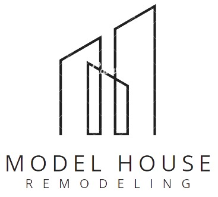

#### Universidad Peruana de Ciencias Aplicadas

#### Ingeniería de Software

#### Profesor Ernesto Campo Tello

#### SW81

# Course Project

## Final Report

## Model House

### Team Members

- Porta Ñaña Diego Alexander - U202019287
- Li Tang Luis Ramón - U202019108
- De La Flor Armas Diego Alonso - U202017237
- Pomasoncco Oropeza Jasmin Gianella - U20201B236
- Maucaille Apolinario Samuel Antonio - U201615989
- Morillo Lagos Martin - U201726085
- Garcia Salas Miguel Humberto - U202011292

#

## Ciclo 2023-02

#

---

# Table Content

### Introducción

<!--UL-->

- 1.1. Startup Profile
  - 1.1.1. Descripción de la Startup
  - 1.1.2. Perfiles de integrantes del equipo
- 1.2. Solution Profile
  - 1.2.1. Antecedentes y problemática
  - 1.2.2. Lean UX Process
- 1.3. Segmentos Objetivo

### Requirements Elicitation & Analysis

- 2.1. Competidores
  - 2.1.1. Análisis competitivo
  - 2.1.2. Estrategias y tácticas frente a competidores
- 2.2. Entrevistas
  - 2.2.1. Diseño de entrevistas
  - 2.2.2. Registro de entrevistas
  - 2.2.3. Análisis de entrevistas
- 2.3. Needfinding
  - 2.3.1. User Personas
  - 2.3.2. User Task Matrix
  - 2.3.3. User Journey Mapping
  - 2.3.4. Empathy Mapping
  - 2.3.5. As-Is Scenario Mapping

### Requirements Specification

- 3.1. To-Be Scenario Mapping
  - 3.1.1. Usuario cliente
  - 3.1.2. Usuario empresa
- 3.2. User Stories
- 3.3. Impact Mapping
- 3.4. Product Backlog

### Solution Software Design

- 4.1. Strategic-Level Domain-Driven Design
  - 4.1.1. Design Purpose.
  - 4.1.2. Attribute-Driven Design Inputs.
    - 4.1.2.1. Primary Functionality (Primary User Stories).
    - 4.1.2.2. Quality attribute Scenarios.
    - 4.1.2.3. Constraints.
  - 4.1.3. Architectural Drivers Backlog.
  - 4.1.4. Architectural Design Decisions.
  - 4.1.5. Quality Attribute Scenario Refinements.
- 4.2. Strategic-Level Domain-Driven Design.
  - 4.2.1. EventStorming.
  - 4.2.2. Candidate Context Discovery.
  - 4.2.3. Domain Message Flows Modeling.
  - 4.2.4. Bounded Context Canvases.
  - 4.2.5. Context Mapping.
- 4.3. Software Architecture.
  - 4.3.1. Software Architecture System Landscape Diagram.
  - 4.3.1. Software Architecture Context Level Diagrams.
  - 4.3.2. Software Architecture Container Level Diagrams.
  - 4.3.3. Software Architecture Deployment Diagrams.

### Tactical-Level Software Design.

- 5.1. Bounded Context: Subscription and payment
  - 5.1.1. Domain Layer
  - 5.1.2. Interface Layer
  - 5.1.3. Application Layer
  - 5.1.4. Infrastructure Layer
  - 5.1.5. Bounded Context Software Architecture Component Level Diagrams
  - 5.1.6. Bounded Context Software Architecture Code Level Diagrams
    - 5.1.6.1. Bounded Context Domain Layer Class Diagrams
    - 5.1.6.2. Bounded Context Database Design Diagram
- 5.2. Bounded Context: Identity Access Management
  - 5.2.1. Domain Layer
  - 5.2.2. Interface Layer
  - 5.2.3. Application Layer
  - 5.2.4. Infrastructure Layer
  - 5.2.5. Bounded Context Software Architecture Component Level Diagrams
  - 5.2.6. Bounded Context Software Architecture Code Level Diagrams
    - 5.2.6.1. Bounded Context Domain Layer Class Diagrams
    - 5.2.6.2. Bounded Context Database Design Diagram
- 5.3. Bounded Context: Smart Home Project Management
  - 5.3.1. Domain Layer
  - 5.3.2. Interface Layer
  - 5.3.3. Application Layer
  - 5.3.4. Infrastructure Layer
  - 5.3.5. Bounded Context Software Architecture Component Level Diagrams
  - 5.3.6. Bounded Context Software Architecture Code Level Diagrams
    - 5.3.6.1. Bounded Context Domain Layer Class Diagrams
    - 5.3.6.2. Bounded Context Database Design Diagram
- 5.4. Bounded Context: Identity Access Management
  - 5.4.1. Domain Layer
  - 5.4.2. Interface Layer
  - 5.4.3. Application Layer
  - 5.4.4. Infrastructure Layer
  - 5.4.5. Bounded Context Software Architecture Component Level Diagrams
  - 5.4.6. Bounded Context Software Architecture Code Level Diagrams
    - 5.4.6.1. Bounded Context Domain Layer Class Diagrams
    - 5.4.6.2. Bounded Context Database Design Diagram

# Student Outcome

## ABET – EAC - Student Outcome 5

<table>
  <tr>
    <td>Criterio Específico</td>
    <td>Realizadas</td>
    <td>Conclusiones</td>
  </tr>
  <tr>
    <td rowspan="6" align=justify>Comunica oralmente sus ideas y/o resultados con objetividad a público de diferentes especialidades y niveles jerarquicos, en el marco del desarrollo de un proyecto en ingeniería.</td>
    <td>TB1 LUIS LI:
comunicación con segmentos objetivos de empresas de remodelación para entender sus necesidades para mejorar los requisitos de usuarios.
</td>
    <td rowspan="9" align=justify>La capacidad de participar efectivamente en equipos multidisciplinarios es esencial para el éxito de los proyectos en soluciones de ingeniería de software. La eficacia, eficiencia y objetividad en la colaboración pueden mejorar la calidad del producto final y la satisfacción del cliente. Por lo tanto, es importante para los ingenieros de software desarrollar habilidades de comunicación, colaboración y trabajo en equipo para lograr un desempeño óptimo en un entorno de trabajo multidisciplinario.</td>
  </tr>
  <tr>
    <td align=justify>
    TB1 Jasmin Pomasoncco : Realizando los Primary Functionality que describen las acciones esenciales que los usuarios realizarán con el sistema, proporcionando una base clara para el desarrollo y las prueba al igual que los Quality attribute Scenarios permiten evaluar cómo el sistema cumple con atributos de calidad.</td>
  </tr>
  <tr>
    <td align=justify>
    TB1 Diego De La Flor: Deployment diagram, competitors and justify content y requirements specification por que es posible entender nuestras características se comparan con las competencias.
    </td>
  </tr>
  <tr>
    <td align=justify>
    TB1 Diego Porta Ñaña:
Presentación en las reuniones del proyecto. Controlando una comunicación fluida entre los artefactos.</td>
  </tr>
  <tr>
    <td align=justify>
    TB1 Morillo Martin:
Actualizacion de los artefactos de los User Stories y Product Backlog.
Presentación en las reuniones del proyecto: A través de la experiencia de trabajar en diversos grupos de trabajo, desarrollé habilidades efectivas de comunicación oral.</td>
  </tr>
  <tr>
    <td align=justify>
    Miguel Garcia Salas
TB1: Se expresaron conceptos técnicos de manera clara y concisa, facilitando la colaboración interdisciplinaria y la presentación efectiva de soluciones y hallazgos en un entorno de ingeniería. Además, se contribuyó a la toma de decisiones informadas y al éxito en la implementación de proyectos tecnológicos
    </td>
  </tr>
  <tr>
    <td align=justify rowspan="5">
    Comunica en forma escrita ideas y/o resultados con objetividad a público de diferentes especialidades y niveles jerarquicos, en el marco del desarrollo de un proyecto en ingeniería..</td>

  <td align=justify>
    TB1 Diego Porta Ñaña:
Actualización de la idea de negocio y como este contiene una solución emergente, en este caso Internet de las cosas (IOT)</td>
  </tr>
  <tr>
    <td align=justify>
    TB1 Jasmin Pomasonco: La descripción detallada de cómo el sistema debe funcionar y cumplir con los requisitos de calidad, mejorando la comprensión y seguimiento del proyecto con la buena documentación.</td>
  </tr>
  <tr>
    <td align=justify>
    TB1 Diego De La Flor: Identificar y comprender las necesidades, conocimientos y nivel jerárquico del público al que nos estamos dirigiendo, mediante reuniones grupales para realizar una comunicación efectiva.
    </td>
  <tr>
    <td align=justify>TB1 LUIS LI: 
    Desarrollo de artefactos de software como el user persona, as-is scenario mapping, etc. para el análisis correspondiente de los requisitos obtenidos previamente</td>
    <td></td>
  </tr>
  <tr>
    <td align=justify>
    Miguel Garcia Salas
TB1: Se redactaron informes técnicos, documentación detallada y otros documentos escritos que transmitan eficazmente la información relacionada con el proyecto.
    </td>
  </tr>
</table>
